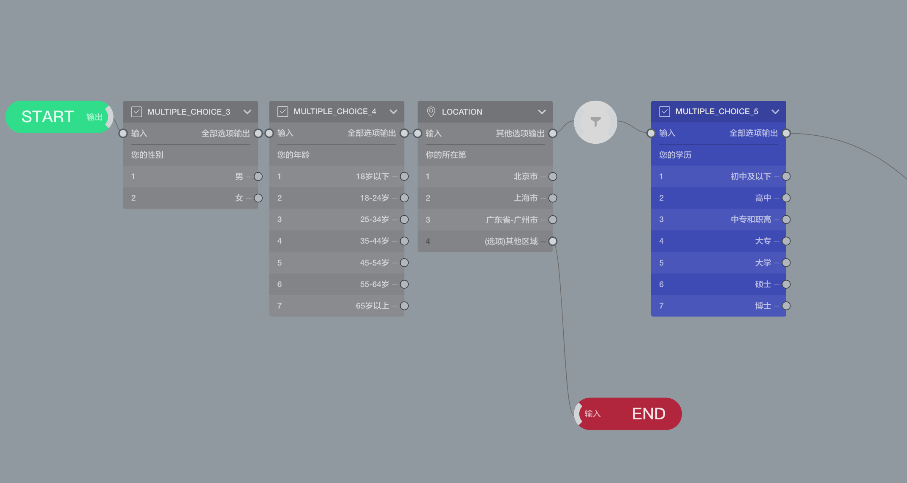

```index
3
```
```tag

```
```summary

```
# 配额和甄别

## 什么是配额

问卷`配额`是指调查人员将调查总体样本按一定属性、特征进行分层或者分类后，分别对各层或者各类确定各类的样本收集数量，在确定数量内任意抽选样本的抽样方法。而这些标志、属性、特征则称为控制特性。例如，对受访者的年龄、收入、教育程度、职业等进行分类，然后分别分配样本的配额数量。

配额一般可分为`交叉配额`与`非交叉配额`。

## 什么是甄别

`甄别`用于判定被访者是否符合目标被访者的要求，`甄别`与`配额`密切相关。在巧思问卷系统中，通过一个`甄别`节点标识出甄别题目，甄别题目的选项就是甄别选项。系统可以针对甄别选项进行配额设定，当问卷中没有甄别选项时，不能对问卷设定配额。

`甄别`节点是一种特殊的节点，`甄别`节点插入问卷后，会将其之前和之后的问卷分为2个模式：
+ `甄别`节点前的节点切换为`甄别模式`，可以被配额引擎识别进行配额设定，画布里节点颜色变为灰色。
+ `甄别`节点后的节点保持不变，也称为`普通模式`，无法被配额引擎识别。

对被访者来说，`甄别模式`节点和`普通模式`节点没有任何区别。

## 在问卷中加入甄别

虽然通过常规题目跳转分支设定也可以实现区别对待部同被访者的效果，但是只有甄别节点才能在配额设置页面中设定的配额。因此，在需要设定问卷配额数量时，必须使用`甄别`节点。

在问卷里新增一个`甄别`节点，并连接到合适的位置，随后按问卷要求，将不符合要求的选项输出连接到结束节点，就完成了问卷甄别设定。

以下图为例：


通过`LOCATION`题目可以看到，位置不在北上广的被访者都未通过甄别，被直接输出到结束节点，代表不满足问卷要求，直接结束，不记录答案，而北上广的被访者会继续问卷答题。

把甄别模式的节点直接输出到结束节点，代表做出这样回答的被访者未通过甄别，不满足问卷要求。这种被访者提交的数据会被系统丢弃，不会被系统收集。

## 设定问卷配额

+ 单配额组

  问卷里加入了甄别功能后，就可以在配额页面设置配额表了。按上图设定，我们计划设定如下配额：问卷计划回收200份数据，但要求对被访者的地理位置进行甄别，其中：
  + 北京：100份；
  + 上海：50份；
  + 广州：50份；

  点击右侧的`新增配额`按钮添加一个配额设置。点击`配额行`中的➕按钮，添加一个`配额组`，然后在组内添加条件中选择`LOCATION`题目，点击下方的`生成配额表格`，页面左侧会生成一个表格，其中列出了`LOCATION`题目中的选项，对北京、上海、成都、广州分别设置数值，代表对这个选项添加了配额数量控制。当被访者选中该选项的数量达到设定数值之后，再出现相同选项的被访者时数据会被抛弃，同时触发`配额满`的Webhook。

  需要注意到是，由于`其他区域`选项被连接到结束节点，所以在配额表格`其他区域`不需要设定任何数值。问卷设计逻辑优先权高于问卷配额，当问卷引擎发现被访者属于`其他区域`时，会触发甄别，直接丢弃该被访者的数据，所以在配额表格`其他区域`里设定数量会导致永远无法完成配额。

  但是，如果`其他区域`没有被连接到结束节点，那么是可以按正常情况，为`其他区域`设定配额数量的。

+ 多配额组

  配额表支持多个配额组，在上面的配额基础上，点击`配额行`中的➕按钮，再增加一个`配额组`。增加配额组后，我们选择`MULTIPLE_CHOICE_3`，并生成配额表格。可以看到配额表增加了一个表格。按如下设定配额：
    + 男：100份；
    + 女：100份；

  现在我们有了2个并列的配额组，此时每个配额组设定的数量是所有配额公用的。如果被访者在北京、上海、广州、成都，并且是男性，那么他会同时占用掉1个男性配额和一个北京配额。极端情况下，如果有80个北京的男性参与问卷调用，会占掉所有北京配额和80个男性配额。

+ 多个配额条件
  
  如果，我们希望对北京、上海、广州、成都的被访者分别设定男、女配额数量，这是就要在一个`配额组`里添加多个配额条件。

  删除当前所欲配额组。随后，点击`配额行`中的➕按钮添加一个`配额组`，然后在组内添加条件中选择`LOCATION`题目，接着，在这个配额组内再添加配额条件，我们选择`MULTIPLE_CHOICE_3`，并生成配额表格。这时，系统会生成一个配额组，包含2个行配额条件，从表格上可以看到，现在我们可以分别对北京、上海、广州设定各自的男性、女性收集数量。
  
  > 一个配额组内，最多允许添加3个行条件。

+ 交叉配额
  
  如果在现有配额基础上，我还想加入年龄作为配额条件。可以沿用上面的方法，在配额行的配额组里再增加一个年龄条件。或者，增加`配额列`，使用`交叉配额`的方法达到相同效果。
  
  点击`配额列`中的➕按钮添加一个`配额组`，在这个配额组内再添加配额条件，我们选择`MULTIPLE_CHOICE_4`，并生成配额表格。这时，系统表格里会增加列配额，包含了年龄题的选项。在行列交叉点的空格里填写数量，这个数量就由行、列配额条件共同控制。例如：北京、男性、年龄在18岁以下的被访者，会占据对应位置的一个配额，直到配额用完。

  > 一个配额组内，最多允许添加2个列条件。


