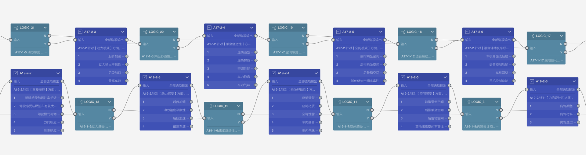
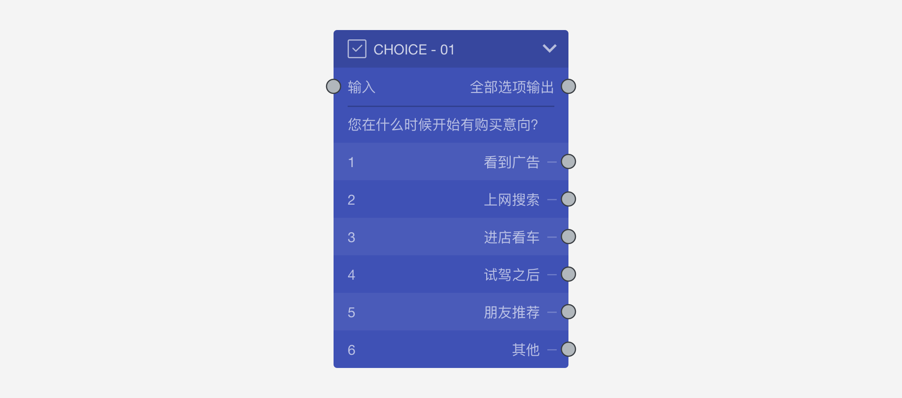

```index
2
```
```tag

```
```summary

```

# 问卷编辑器画布区

`问卷编辑器画布区`是`问卷编辑器`的主区域，文档中的画布区、画布，都是指问卷编辑器画布区。画布里展示的是整个问卷流程，显示问卷的题目节点、跳转连线、题目组合等问卷核心部分，配合工具栏支撑起各种问卷编辑操作，问卷核心编辑操作均在画布完成。

问卷内容较多时画布中只能看到问卷的一部分，拖拽画布空白区域可以查看问卷的其他部分，也可以直接点击或拖拽画布右下角的`鹰眼缩略图`上的线框，快速跳到问卷的其他部分。鹰眼用于展示整份问卷的缩略图，鹰眼里面的小方框代表当前画布区域范围，从鹰眼可以看到整份问卷的内容和当前画布在整份问卷中所处的位置。

> 使用分辨率高的显示器，会让画布有更多的显示空间，设计问卷时更方便。

## 基本概念

### 节点
`节点`是问卷的最基本构成元素，节点在画布上表现为各种颜色的小方块，每种颜色代表一种题型或功能。


节点分为2种类型：
+ 题型节点：题型节点代表一种特定题目类型，一个题型节点就是一道问卷题目。
+ 工具节点。工具节点是问卷的一个特定功能，一个工具节点就是执行一个功能。

> 文档中的`题目`和`节点`一般代表相同的意思。
  
从`开始节点`到`结束节点`，问卷流程动线遇到一个节点时，要么显示一道题目，要么完成一个功能，通过观察画布上的节点和它们之间的连线，一目了然地看到问卷的基本架构。
> 一份问卷只能有一个开始节点，但可以有多个结束节点。
 
> 全部节点可参见[节点类型](../nodes/concept.md)中详细介绍

### 节点构成
大部分节点在画布中表现为一个方块。


上图是一个典型的节点方块，从上到下依次为：
+ 节点图标、节点名称、和节点收展按钮
+ 节点输入口和快捷输出口
+ 节点题目的内容文字 
+ 节点选项列表，每行代表一个选项。左边数字是选项编号，右侧文字是该选项的名称。有时，选项的最右侧显示了选项的输出口，可以为每个选项设定不同的输出。


上图中，`RANKING_2`节点包含[引用选项](../opt-reference/concept.md)和[其他选项](../node-setting/other-option.md)，他们和普通选项的展示方式不一样。

> `RANKING_2`节点的右上角外显示了红色闪电标记，代表这个节点的设置存在错误，把鼠标放到闪电上会出现红色的错误提示文字，就能知道哪里设置不对了。带有红色闪电的问卷意味着存在错误，所以无法发布。


### 输入口和输出口
节点上显示的小圆圈是节点的端口，端口分为输入口和输出口，它们各有不同的特性：


+ 输入口：
    + 只能作为连线的终点。
    + 一个节点的输入口可以作为多条连线的终点。
    + 一个节点只有一个输入口。
    + 显示在节点左上方。
+ 输出口：
    + 只能作为连线的起点。
    + 一个节点的输出口只能作为一条连线的起点，也就是说从输出口只能往外连一条线。
    + 一个节点可以有多个输出口。
    + 显示在节点右侧。

所有节点的输入口和输出口都必须有连线，除了下面的特殊情况：
+ 开始节点：只有输出，没有输入。
+ 结束节点：没有开启奖励的情况下，只有输入，没有输出。
+ 奖励节点：只有输入，没有输出。

### 快捷输出口
节点右上方有一个特殊的`快捷输出口`，快捷输出口有以下2种状态：


+ 全部选项输出：无论如何选择，都会从此输出口输出；
+ 其余选项输出：除了已经连线的选项输出口外，剩余的所有选项都会从此输出口输出；

快捷输出口主要用于提高工作效率，这样就不必为每个选项设置大量相同的输出了。

### 连线
连线代表问卷的进行流程动线。拖动节点的输出口，可以拉出一条弹性连线，把连线连接到另外一个节点的输入口，连接这2个节点后就形成了一个前后关联的关系。答题时，体现为答完一道题后按连线走到下一题。

<video id="video" autoplay="autoplay" loop="loop">
    <source id="mp4" src="https://media.choiceform.com/doc-help/zh-cn/design/layout/canvas/connect.mp4" type="video/mp4">
</video>

问卷题目常常会包含各种选项，每个选项也有自己独立的输出口，从选项输出口连线到另一个节点，代表被访者选中该选项时，则会跳到该选项的输出口连接的那个节点。

### 节点收起与展开
点击节点左上角的小箭头收起或展开节点，当选项较多且不想经常看到选项时，收起节点会更使画布更简洁。

<video id="video" autoplay="autoplay" loop="loop">
    <source id="mp4" src="https://media.choiceform.com/doc-help/zh-cn/design/layout/canvas/collapse.mp4" type="video/mp4">
</video>

### 中转点
`中转`节点用与于将连接到同一个节点的连线汇集在一起，先把这些连线一起归集到中转节点，然后把中转节点连接到后续节点，从而优化问卷连线的视觉效果。在连线比较复杂的情况下，可以添加中转点来让连线的归集更加整洁。中转点可以接受多个输入，但只能有一个输出。

按住`Alt`键，点击连线，就可以在该处添加一个中转点。中转点可以接受多个输入，只可以输出一次。与中转点相连的连线都会变成直线。

<video id="video" autoplay="autoplay" loop="loop">
    <source id="mp4" src="https://media.choiceform.com/doc-help/zh-cn/design/layout/canvas/dot.mp4" type="video/mp4">
</video>

在连线比较复杂的情况下，可以添加中转点来让连线的归集更加整洁。

### 节点组合
多个节点可以进行组合，组合后节点组也可以收起和展开，收起后的节点组会收缩成一个小方块，组合内的节点都会藏起来。

<video id="video" autoplay="autoplay" loop="loop">
    <source id="mp4" src="https://media.choiceform.com/doc-help/zh-cn/design/layout/canvas/group.mp4" type="video/mp4">
</video>

> 参照[组合与模块](../groups/concept.md)了解更多组的信息。


