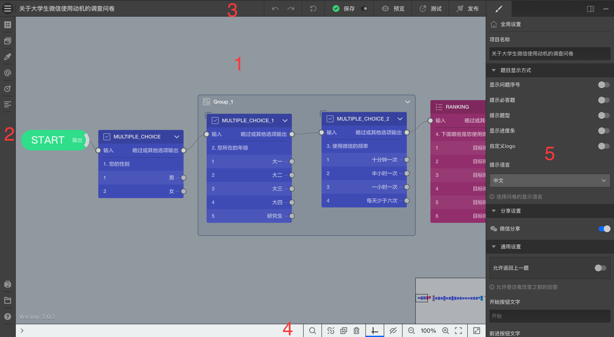

```index
1
```
```tag

```
```summary

```

# 问卷编辑器



## 问卷编辑器操作界面
如上图所示包含以下几个部分，点击链接可以查看各部分的详细情况：
1. [问卷编辑画布区](./canvas.md)：问卷编辑器的核心区域，用于摆放问卷题目，并关联题目间的关系。
2. [问卷组件工具栏](./toolbar.md)：问卷编辑器的主要工具。
3. [问卷发布工具栏](./navbar.md)：问卷预览、发布及问卷保存等操作。
4. [视图工具栏](./footbar.md)：问卷视图操作工具。
5. [属性编辑栏](./sidebar.md)：展现问卷和节点的各项属性设置。
