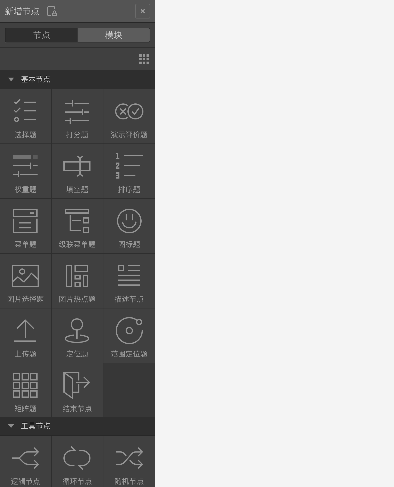
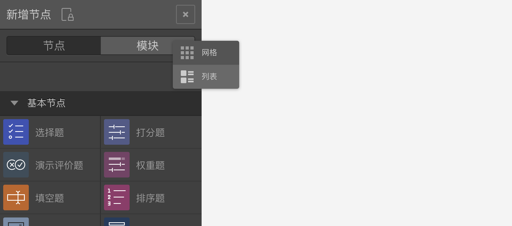
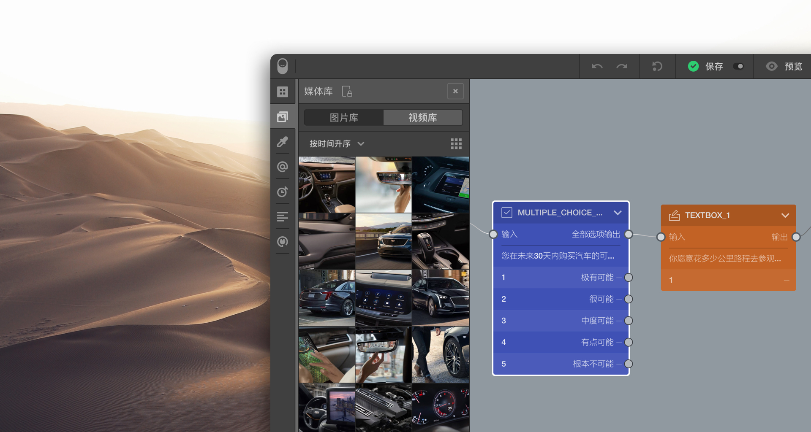
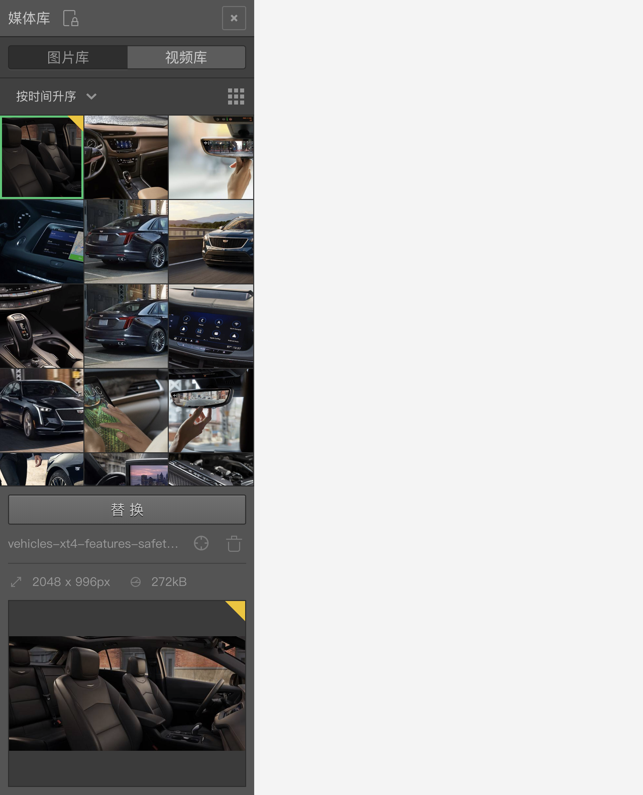
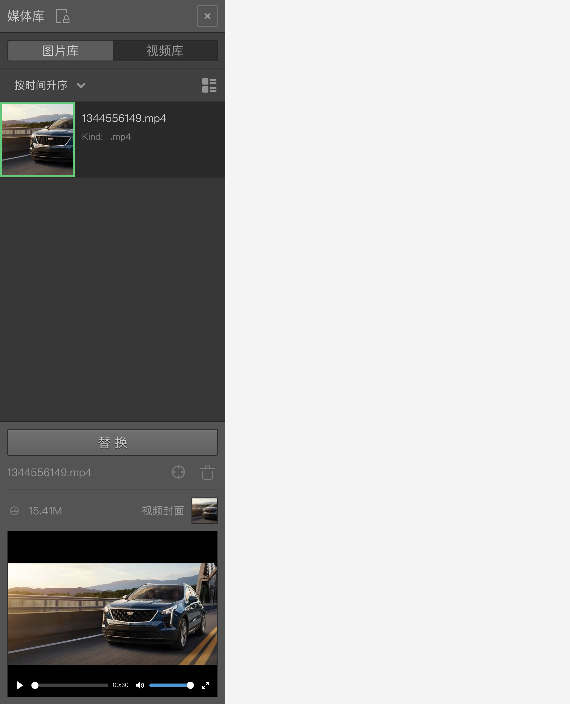
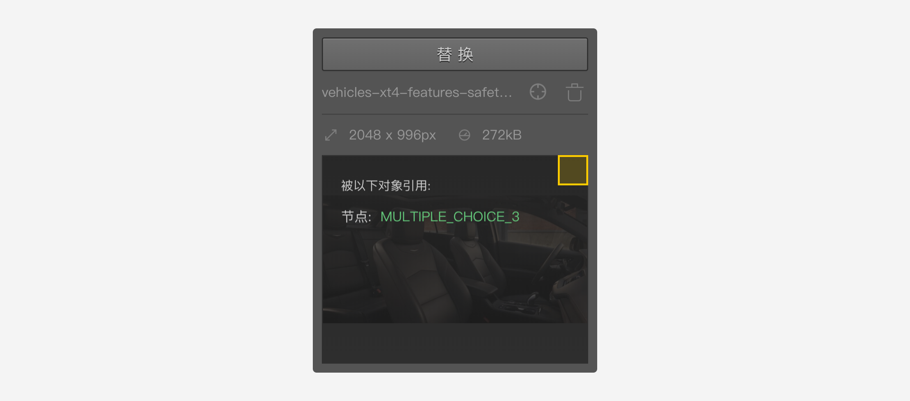
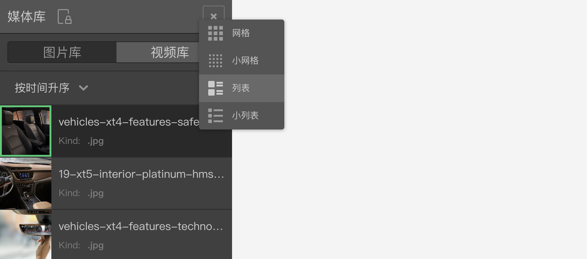
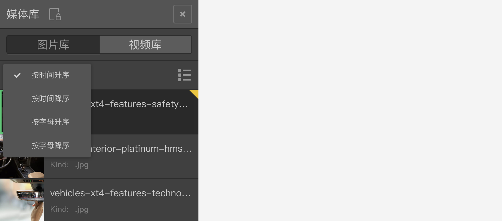
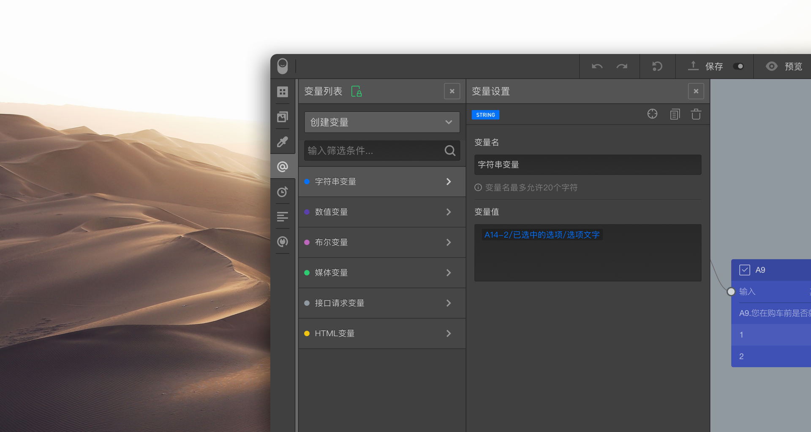
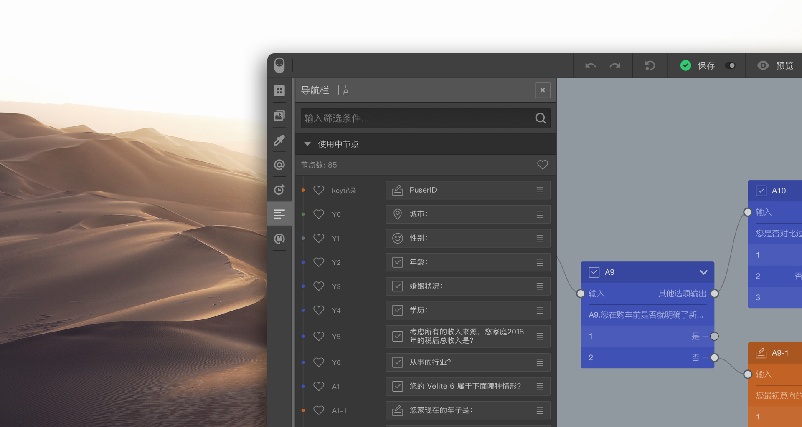

```index
3
```
```tag

```
```summary

```

# 问卷组件工具栏

`问卷组件工具栏`整合了问卷编辑系统核心功能组件的入口，点击按钮滑出具体的组件工具面板。


从上到下依次是：
+ 新增节点
+ 媒体库
+ 主题
+ 变量库
+ 计时设置
+ 节点导航
+ 内置接口


+ 打印问卷
+ 文件操作
+ 帮助

## 新增节点

`新增节点`面板里是系统的所有预置`节点`和`内容`模块。点击滑出新增节点库面板，其中包含`节点`和`模块`两个版块。



+ 节点：
`节点`里是系统的所有节点，包含`基本节点`和`工具节点`。点击节点图标，在画布区新增一个节点。或者拖动节点图标到画布的指定位置后释放鼠标，在指定的位置添加节点。

+ 模块：
`模块`里是用户保存的各类`问卷内容模块`。问卷内容模块是一组已编辑好的节点的集合，有时，因为某些题目组合在不同问卷中都会被使用，我们可以把这些题目节点存储为一个问卷内容模块。使用时，拖拽内容模块到画布区，就能在当前问卷中添加该内容模块。

  选中模块后，下方信息面板会标明该模块创建者、创建时间、包含的节点数量、变量数量、图片或视频数量等等。点击信息面板上方的删除按钮，可以删除该模块。

> 在同一账号或组织里都能看到保存的问卷内容模块。

网格按钮用于切换排列方式。


## 媒体库

`媒体库`用来管理当前问卷中的媒体资源。点击滑出媒体库面板，其中包含`图片库`和`视频库`两个功能区。



+ 图片库：问卷中的所有图片素材。

 
+ 视频库：问卷中的所有视频素材。视频资源会默认使用视频的首帧作为缩略图。

  > 视频上传后，详细信息栏里可以预览观看视频。

+ 上传媒体：
点击下方的`上传`按钮上传媒体资源文件，上传完成后，媒体资源会显示在列表中。

+ 查看媒体信息：
选中媒体库里的媒体资源，下方滑出该媒体资源的详细信息面板。


  媒体资源可以在`节点`和`变量`中引用。问卷中被引用的媒体资源右上角会有一个三角标记。如果三角形是半透明的，则说明该媒体资源虽然被引用了，但是使用它的节点或变量并没有被问卷实际使用。

  鼠标移动到三角标记上，会显示引用了该媒体的节点清单，点击清单里的节点，画布会快速定位该节点，并居中显示。

+ 删除媒体：
详细信息面板里，点击媒体资源名称右侧的删除图标，删除该媒体。

+ 定位媒体：
详细信息面板里，点击媒体资源名称右侧的定位图标，在媒体资源列表中快速定位中该媒体。

+ 替换媒体：
选中媒体库里的媒体资源，`上传`按钮变成`替换`按钮。点击`替换`按钮并重新选择一个媒体文件，将会上传并自动替换当前的媒体文件，替换媒体资源会自动更新问卷里所有使用该媒体资源的地方。

系统提供了3种媒体素材布局方式：

+ 网格
+ 列表
+ 小列表

还可以对媒体素材进行不同方式的排序：

+ 按时间升序
+ 按时间降序
+ 按字母升序
+ 按字母降序

> 关于媒体的使用方法参见[图片的使用](../media/image.md)和[视频的使用](../media/video.md)。关于媒体在变量中的使用请参见[媒体变量](../variable/media-type.md)。

## 主题

`主题`用于问卷颜色、字体大小等样式控制，点击后滑出`主题`面板。


+ 样式
用于设定问卷标题、问题、选项等主要内容类型的颜色、字体等样式。

+ 模版
系统预设了一些配色模板方案，用户也可以保存自己配色模板方案。


> 关于问卷样式的具体控制技巧，参见[主题与样式控制](../theme/concept.md)。

## 变量库

`变量库`用于创建和管理问卷使用到的`显式变量`，点击后滑出变量库面板。



+ 创建变量：
点击`创建变量`，然后选择变量类型，在滑出的`变量设置`面板中添加变量名和变量值，设置完毕后就能添加一个变量。

+ 查看变量信息：
点击`变量列表`中的变量，右侧变量设置面板中就会展现该变量的内容。右上角的三个按钮分别能定位变量、复制变量和删除变量。变量设置面板中，还显示使用了当前变量的对象，点击对象名称，将会定位到该对象。

变量可以在节点中使用，也可以被其他变量当成运算项再次使用。被使用过的变量列表项的右上角会有一个三角形标记。如果三角标记是半透明的，则说明该变量虽然被引用了，但是引用它的节点或变量并没有被问卷实际使用。

> 变量是设计复杂问卷的利器，但要使用好它则必须掌握变量的详细规则和概念，详情参见[变量](../variable/concept.md)里面的完整说明。

## 计时设置

`计时设置`用于控制问卷及每道题的答题时间，点击后滑出计时设置面板。


> 计时设置会对问卷的数据收集带来一些限制，关于时间设置的具体用途，请参见[计时设置](../timing/concept.md)

## 节点导航

`节点导航`面板列出当前问卷的所有节点，包括已使用和未使用节点在内。点击后滑出`节点导航`面板。


+ 改变问卷题目的输出顺序
问卷默认按深度优先策略遍历并输出，并且在节点导航面板中顺序展现。拖拽题目右边的图标改变题目的输出顺序，这个顺序也将会成为问卷数据结果展现时题目列的默认顺序。

支持一键删除未使用节点。

> 可对题目节点打星标。

## 内置接口

`内置接口`用于编写和管理内置接口代码，点击后滑出内置接口面板。


详情参见[内置接口](../embed-api/concept.md)。

## 打印问卷

打开`问卷打印预览`页面，详情参见[问卷打印预览](../preview/print.md)。

## 文件操作

导入或导出问卷，详情参见[问卷导入导出](../advance-topic/import-export.md)。

## 帮助

常用系统帮助链接。

