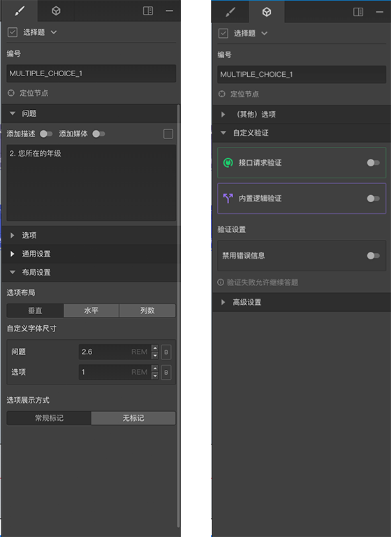

```index
1
```
```tag

```
```summary

```
# 节点通用设置

选中一个节点后，右侧属性编辑栏中会显示该节点的属性设置内容，顶部一般会包含2个切换按钮，用于切换属性编辑栏的内容面板，每个面板下面会有多个功能区，点击功能区的头部标题可以展开或收起该功能区。



上图显示了属性编辑蓝包含的2个面板，分别为：
+ `编辑`面板：包含`问题`、`选项`、 `通用设置`和`布局设置`功能区。
+ `设置`面板：包含`其他选项`、`自定义验证`和`高级设置`功能区。
  
节点通用设置主要说明绝大多数节点都会用到的共有的设置项，点击下方的链接查看每个功能区的详情：

## [头部](./header.md)
## [问题设置](./question.md)
## [选项设置](./option.md)
## [选项排他](./option-exclude.md)
## [输入验证](./input-validation.md)
## [自动提示](./auto-complete.md)
## [通用设置](./common.md)
## [选项随机](./option-random.md)
## [高级设置](./advanced.md)
## [布局设置](./layout.md)
## [其他选项](./other-option.md)
## [自定义验证](./custom-validation.md)

> 不同的节点还会包含一些特有的功能区，将会在节点介绍中具体说明。