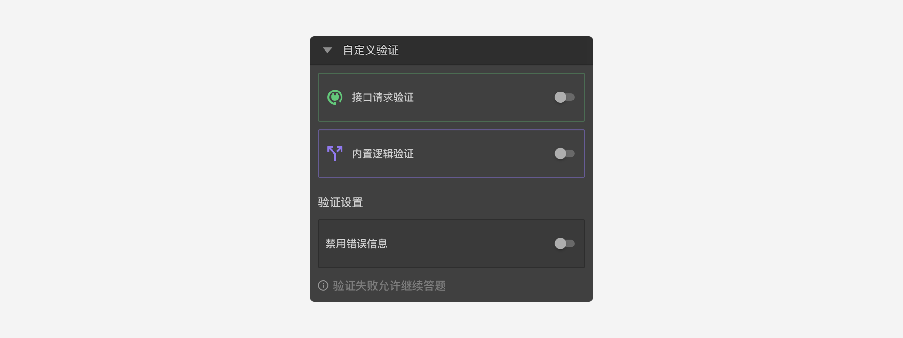

```index
12
```
```tag

```
```summary

```
# 自定义验证

题目的验证机制用于设定问卷回复规则，避免接收被访者输入无效的答案。

`自定义验证`在节点属性编辑栏的`设置`面板中，打开后可以看到其中包含`接口请求验证`和`内置逻辑验证`两个开关，以及一个`禁用错误信息`的开关。


## 接口请求验证：
对于个性化的自定义验证需求，可使用`接口请求验证`来完成验证。接口请求验证会请求一个配置好的验证接口并传入参数，通过检查接口的返回结果来决定是否通过验证。如果没有通过，接口返回的内容中还可以携带未通过的原因说明，被访者答题过程中可以实时看到被拒绝的原因。接口逻辑验证的优点是功能强大。

  > 具体的工作方式参见[接口请求](../advance-topic/request.md)。

    > 接口请求验证的接口开发要求具备基础编程能力。

## 内置逻辑验证：
虽然接口验证很强大，但是要在外部开发一个接口。而`内置逻辑验证`可以实现一部分接口请求验证的功能.`内置逻辑验证编辑器`内置了一些常用的逻辑运算功能，通过检查逻辑运算结果确定是否通过验证，如果没有通过，接口返回的内容可以携带未通过的原因说明，被访者答题过程中可以实时看到被拒绝的原因。内置逻辑验证的优点是开发较为简单。

  > 内置逻辑运算的规则参见[内置逻辑编辑器](../logic/logic-editor.md)。

  > 内置逻辑运算工作方式参见[逻辑验证](../logic/validation.md)。

# 验证设置
## 禁用错误信息：
设置`自定义验证`后，如果没有通过验证，则会显示由验证设置中提供的提示文字信息，随后要求被访者必须修正答案直到正确通过验证。

但是也可以隐藏这个错误消息，没有通过验证时既不会显示错误提示，也不会阻止他们继续下一题。这种情况下，这道题目会被标记为`自定义验证失败`的状态（参见[隐式变量](../variable/implicit.md)），该状态在后续问卷中可以用于进行其他操作，比如：记录被访者答题错误的次数，超过限定值则判定为没有认真作答，并触发对应处理机制。
