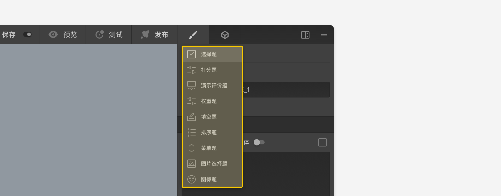

```index
2
```
```tag

```
```summary

```
# 节点设置头部区域

节点设置面板的`头部`区域显示了该节点的`类型`、`编号`信息，和`定位节点`按钮。


+ 节点类型：
点击`节点类型`名称弹出`节点类型转换`菜单，显示了当前节点可切换的其他题型。在不同题型之间转换时，只有题型之间共有的设置才会被保留，非共有的设置及其相关的连线也会被自动丢弃，以适应转换后的新题型。



+ 编号：`编号`是当前节点的唯一标记，问卷中不能存在编号相同的题型节点，编号可以修改。

+ 定位节点：
点击`定位节点`，该节点会被移动到画布的中央。
