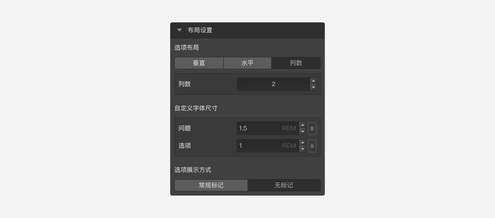

```index
10
```
```tag

```
```summary

```
# 布局设置

`布局设置`用于设置题目选项的布局，并可以对选项内容进行仅对该题目有效的局部调整。



## 选项布局

用于设置选项的排列方式，可选`垂直`、`水平`，或者设定为按`列数`排列。
+ 垂直：

+ 水平：

+ 列数


## 自定义字体尺寸

用于调节题目页面里问题和选项文字的大小。


`字体控制`默认由全局样式控制，[全局样式控制](../theme/concept.md)中字体大小改变时，所有问卷节点的字体大小都会跟随着改变。

在节点的`布局设置`中更改字体设置后，对应设置项前面会出现一个小绿点，表明个性化设置已经覆盖的全局设置。个性化设置的优先权高于全局设置，所以无论全局设置如何改变，这个节点的设置会保持不变。鼠标覆盖后小绿点后会变小红点，点击小红点解除个性化设置，解除后该节点又会自动跟随全局样式控制了。
