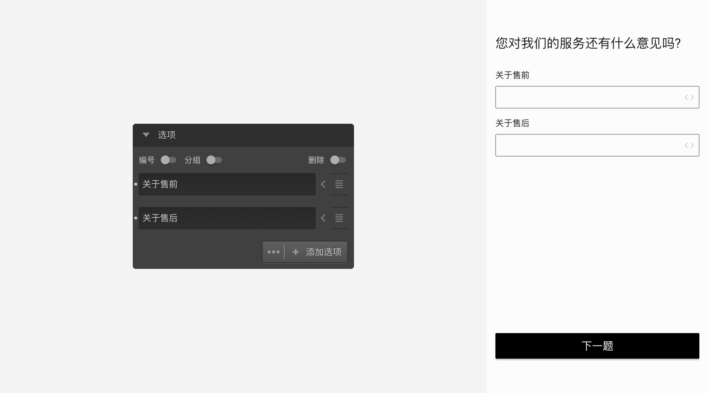

```index
5
```

```tag

```

```summary

```
# 填空题

`填空题`用于让被访者输入对题目的回答、评价、说明等文字内容。填空题支持多个填空项，被访者可以在一道题目里输入多个不同的内容。


如图，被访者可以分别输入对售前和售后服务的评价文字内容。


+ 输入内容验证：
对每一个填空项设置验证规则，详情参见[输入验证](../node-setting/input-validation.md)。


## 通用设置

+ 最小输入项限制
设定必填填空项的数量，参见[最小输入项验证](../node-setting/common.md#最小输入项限制)。


> 不同题型或功能节点共有的通用设置在[节点设置](../node-setting/concept.md)中有讲解，此处只讲解填空题特有的功能。