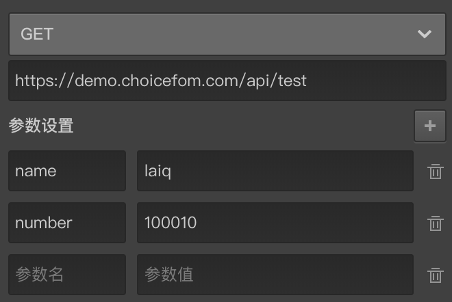

# 接口请求

针对一些复杂的问卷逻辑运算和判断，内置逻辑运算功能无法满足需求，这时候可以使用外部请求程序协助。
> 接口请求功能要求具备基本编程能力。

接口请求变量在以下地方都可以使用，熟练使用后能极大扩展问卷性能。
+ [接口请求变量](../variable/request-type.md)
+ [节点自定义验证](../node-setting/custom-validation.md)
+ [开始节点出示验证](../nodes/start.md)
+ [结束节点的结束请求](../nodes/end.md)

## 请求方式：
+ GET: 以HTTP的GET方式请求远程接口,参数会当成queryString拼接到url后面。
+ POST: 以HTTP的POST方式请求远程接口，参数会放到body中。
+ FAKE: 自定义的请求方式。
+ EMBED: 自定义的请求方式。



上图是一个接口请求的设置，点击头部的下拉列表选择请求方式，请求方式包含GET/POST/FAKE/EMBED。然后填写请求地址。最后是设置添加请求的参数名和参数值。

答题过程中，当问卷运行使用接口请求的地方时，就会携带参数往指定地址发送一次请求，并期待接口返回以下格式的数据：

```typescript
    {
        result: {string|number|boolean}   // 计算结果，如果是验证性接口，返回false代表验证失败，返回true代表验证成功，非验证性的接口返回数值或字符转作为计算结果
        message?: string // 针对验证型的接口，如果result属性是false，没有通过验证，这时应该通过message属性携带一个验证失败的消息，
    }
```

关于返回结果的message属性还可添加带有特殊意义的格式，不同的格式对答题页会造成不同的影响：
+ `https://` 开头的URL：收到返回结果后会跳到该地址，离开问卷。
+ `vital:` 开头的消息文本：会弹出消息文本并终止答题。
+ 其他：以下拉警告浮窗的方式滑出消息文本。


### FAKE方式请求

FAKE请求是调用服务器上部署好的javascript脚本，该脚本需要按指定的规范编写。

下面用案例说明，目标是实现以下需求：

+ 用`FAKE`方式调用接口`https://xxx.test.com/plugin/sum_gt0`，并且该接口要求两个参数`number1`和`number2`，这个接口的作用是判断两个数相加是否大于0；
+ 同时，还要调用`https://xxx.test.com/plugin/gt`, 该接口也要求两个参数`number1`和`number2`，这个接口的作用是判断前面一个数是否大于后面这个数。

则需按下面的步骤操作：

1. 首先按如下规范编写一个脚本
```javascript
    (function () {
        // 前面三行这样写,这是定死的规则
        var plugin = window.CFPlugin = window.CFPlugin || {};
        var server = plugin.fakedServers = plugin.fakedServers || {};
        var space = plugin.currentSpace;

        /**
        * 在server中按下面的规则添加一个方法,则该方法会负责该命名空间下的sum_gt0接口的请求
        * 即对 https://xxx.test.com/plugin/sum_gt0 发起的请求其实会调用该方法,被该方法
        * 接收并处理
        */
        server[space + '/sum_gt0'] = function (data) {
            // 这里用到了data中的两个属性number1和number2,这是参数,
            // 返回格式参考上面规范
            return {
                result: Number(data.number1) + (data.number2) > 0,
                message: 'message',
            };
        };
        // 并在这个方法后面以这个方式标注参数规范
        server[space + '/test'].params = ['number1', 'number2']

        /**
        * 在server中按下面的规则添加一个方法,则该方法会负责该命名空间下的gt接口的请求
        * 即对 https://xxx.test.com/plugin/gt 发起的请求其实会调用该方法,被该方法
        * 接收并处理
        */
        server[space + '/gt'] = function (data) {
            // 这里用到了data中的两个属性number1和number2,这是参数,
            // 返回格式参考上面规范
            return {
                result: Number(data.number1) > (data.number2),
                message: 'message',
            };
        };
        // 并在这个方法后面以这个方式标注参数规范
        server[space + '/test'].params = ['number1', 'number2']

        // 下面的是补充说明
        // 所以: 对 https://xxx.test.com/plugin/test_2 的请求将会被下面这个方法处理掉
        server[space + '/test_2'] = function (data) {
            // input code here
            // 具体的规则都写到这个方法里面
            return {...}
        }
        // 如果要伪造 https://example.cf.io/fake/test 接口
        // 则需要一本fake.js的脚本部署到 https://example.cf.io 中,并且按上面的格式编写,有一个'test'方法即可
    })();
```

2. 将该脚本部署到服务器上，保证通过`https://xxx.test.com/plugin.js`地址能访问到刚才的那本脚本。

3. 将请求方式设置为`FAKE`，地址填写`https://xxx.test.com/plugin/sum_gt0`，并添加两个参数number1和number2,并各自给他们指定一个值，对于另个一接口则地址填写`https://xxx.test.com/plugin/gt`，参数也相同指定即可。

> 地址其实就是脚本所在的地址去除掉.js后缀再接上对应的方法名。

4. 申请可信任白名单，因为脚本会部署到你自己的服务器上，而这个服务器地址并不在本系统的可信任白名单上。这时，可以联系我们的客服，客服了解情况后会把你脚本所在地址加入系统白名单。

    > 系统会拒绝加载不在白名单地址的脚本。
    > 如果检测到你的服务器地址中的FAKE脚本中包含不安全的执行代码，则会将其移出白名单。

5. 如果以上几步都完成，则问卷运行到使用了该请求设置的地方，就会执行该脚本中的指定方法得到计算结果。
 
 > 上面的`https://xxx.test.com/plugin`是一个举例，真实场合你可以部署到url。
> 上面两个例子运算太简单了，其实用编辑器的内置逻辑运算就能做到，这里仅仅是为了举例，一般来说非常复杂的运算才使用接口。


### EMBED方式请求

FAKE部署方式过于繁琐，这时可以使用EMBED方式，EMBED方式允许在编辑器中直接编写`javascript`代码，达到和FAKE方式相同的效果，且更简单。

> 一般来说，代码量较少时可以使用EMBED方式，代码量很多的时候使用FAKE方式维护起来更方便。
> 还有一个重要区别，使用EMBED方式的接口代码，在问卷发布后无法被修改，使用FAKE方式的，则没有这个限制。

在[内置接口](../embed-api/concept.md)可以添加内置接口，其编辑方法也会在其中进行讲解。

当选择了EMBED方式时，不再会有url输入框，而是变成一个下拉列表，在下拉列表中可以选择使用之前添加过的`内置接口`。

> 如果发现某个账号下的问卷在EMBED方式中使用了不安全的脚本，则账号可能会被禁用。
