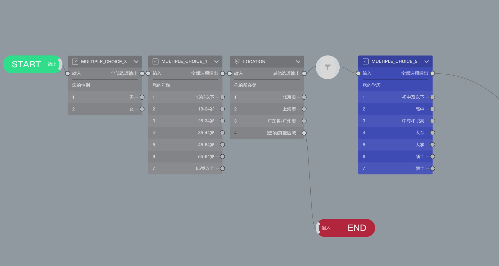

## 甄别与配额

### 甄别
甄别用于从被访者中筛选出符合条件的被访者。

### 设置甄别条件
在问卷中插入[甄别节点](../nodes/screening.md)可以将其之前的题目变成`甄别模式`。

如上图所示，`甄别模式`的题目会变成灰色。这些甄别模式的节点带有特殊的用途，主要用于对被访者的信息识别和资格判定。

从处于甄别模式的节点（灰色节点）直接输出到结束节点，代表做出这样回答的受访者未通过甄别，是不满足问卷要求的。这种受访者提交的数据会被系统丢弃，不会被系统收集。以上图为例：通过`LOCATION`这一题可以看到，凡事位置不在北上广的被访者都未通过甄别、不满足问卷要求，直接结束，而北上广的被访者会继续问卷答题。

### 配额
甄别结合配额设定，可用于控制符合每个甄别条件的被访者的总数量。这样就可以把问卷收集的总数量分配给不同的甄别条件。

> 甄别与配额结合可以作为控制问卷回复数据代表性的手段。

沿用上图中的案例，我们看到处于甄别模式的题目有性别、年龄和地理位置，假设有这样的需求：对其他通过甄别条件的人，男性最多只需要收集200份数据，女性最多只需要收集500份数据，18岁以下的只需要收集10份数据，北京市的只需要收集50份，这时就需要用到配额控制。

进入问卷发布

在配额界面中只能看到甄别模式的节点，如果没有甄别模式的节点，则无法进行配额设置；可以针对每个甄别模式题目的选选项设置配额数据，为了完成上述需求，我们需要在配置设置对`MULTIPLE_CHOICE_3`，并对它的选项`男`设置200个配额，对选项`女`设置100个配额，对`MULTIPLE_CHOICE_4`的选项`18岁以下`设置10个配额，对`LOCATION`的选项`北京市`设置50个配额。

按以上设置好配额后，如果选择`男性`的受访者提交的数据已经达到200份，后来又有一个受访者选择了`男性`，则这个受访者在答完所有`甄别模式`的题目后会得到一个配额已满的提示，无法继续答题，其他几个配额规则的作用相同，不一一赘述。

甄别和配额适合用于对受访者进行事先的筛选，和对某些条件下的回复控制收集数量。
