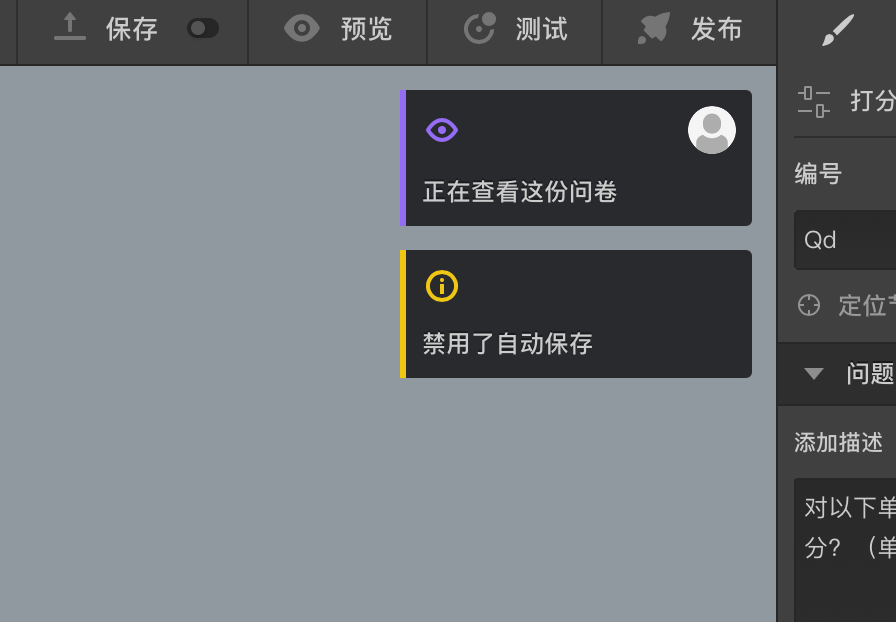
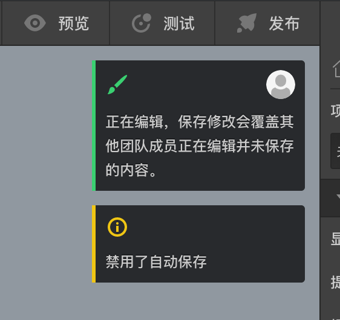
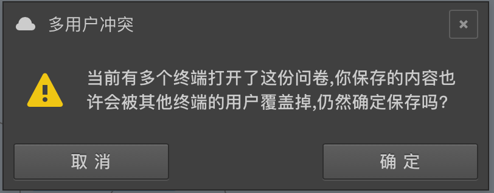
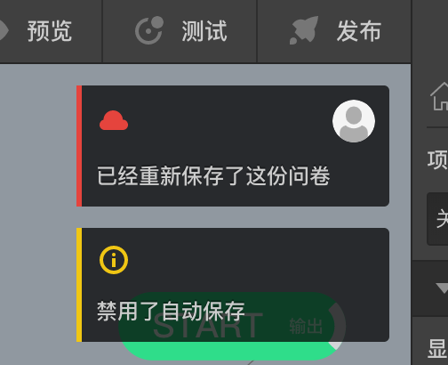
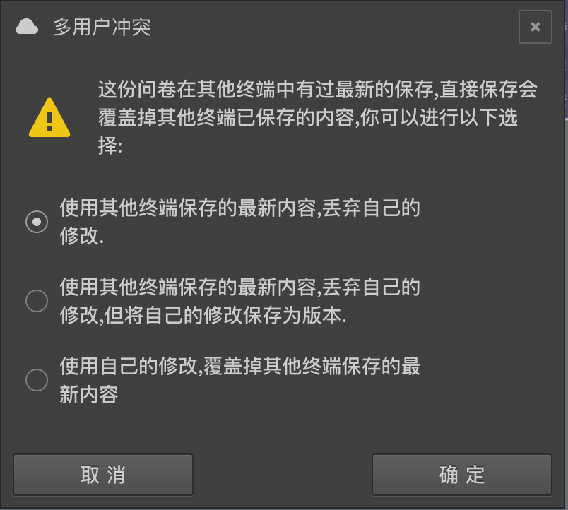

# 多用户冲突

同一个账号可以在不同的终端进入编辑器查看同一份问卷，同一组织下的不同账号也可以同时进入编辑器查看同一份问卷。

这种时候会进入多用户冲突的状态，问卷画布坐上叫会弹出提示卡片：

显示了其他某个用户也正在查看该问卷，鼠标放在用户头像上能看到该用户的名称；多用户冲突状态下会禁用自动保存功能。

这种状态下，如果某个用户对问卷进行了修改，则其他用户的界面上就能看到该用户的卡片变成了正在编辑的状态。

这是时候尝试保存会弹出警告框：

如果某个用户修改并保存了，则对应卡片会变成已保存的状态：

这是后其他用如果尝试保存则会弹出更严重的警告，并必须做出明确的选择或放弃保存：

尽量避免进入多用户冲突状态，如果因为组织下多用户同时协作进入了该状态，则确保协调好好，不要每个人都编辑和保存，否则某些的辛苦工作成果可能会丢失。

自己同一账号在不同电脑或浏览同时进入同一问卷的编辑器，也会出现这种状态，这时候要明白自己在干什么。

