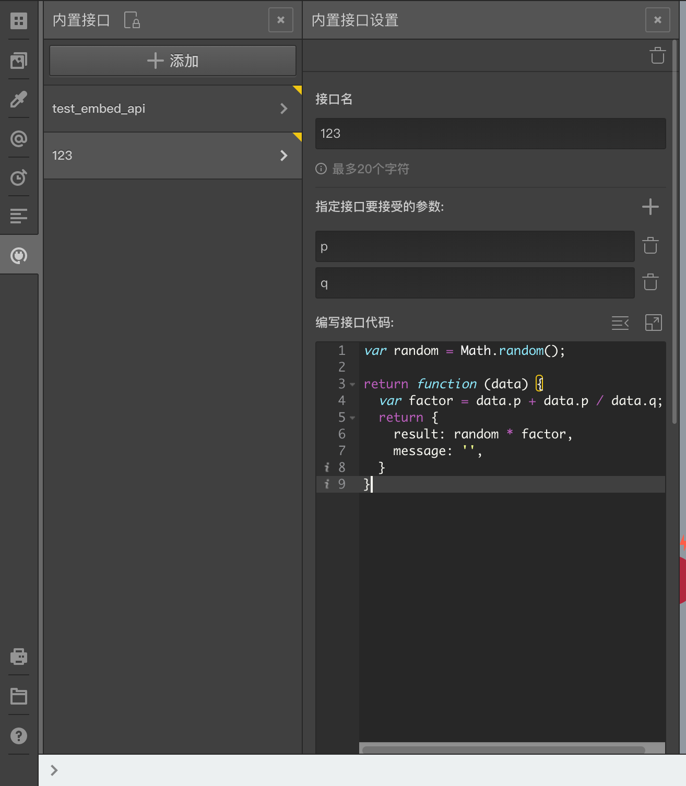

# 内置接口

> 提示：该功能要求问卷设置者具备编程能力，或者寻找程序员小伙伴帮忙。

在[接口请求](../advance-topic/request.md)中提到了四种请求方式，其中一种是`EMBED`方式，需要用到`内置接口`。

点击左侧工具栏的`内置接口`按钮可以打开内置接口管理栏，点击`添加`按钮即可添加一个内置接口。




内置接口需要指定一个名称和一段`javascript`代码，可以添加参数和测试样例代码，配置好的内置接口在[接口请求模块](../advance-topic/request.md)中可以使用。

## 内置接口列表

添加后的内置接口会显示在内置接口列表中，点击任意项打开详细设置页面。
如果内置接口名称的右上角有一个黄色的小三角图标，说明该接口已经被题目节点所使用；如果小三角图标是半透明的，说明接口虽然被题目节点使用，但该题目节点没有被连接到问卷中。

## 设置项

### 接口名
该接口的名称，在`接口请求模块`中可以根据名字选择想要使用的内置接口。

### 参数
可以指定参数，指定参数名后，在接口请求模块中使用该内置接口时，必须为所有参数传入参数值。
接口代码可以从接口处理函数的第一个参数中用取属性的方式获得真实的参数，如上图中所的参数`p`和参数`q`一样，这个规则和接口请求中的`FAKE请求方式`的参数访问规则相同。


### 接口代码
编写任意`javascript`代码。
接口代码最后必须返回一个函数作为接口处理函数，该函数的返回值必须是[接口请求](../advance-topic/request.md)里面提到的返回数据接口,即一个包含result和message属性的对象。

以上图中代码为例；这个名为`123`的接口要求两个参数`p`和`q`，在代码中，从处理函数的第一个参数`data`中取出真正的参数`p`和`q`，然后用`p`加上`p`与`q`的商作为计算因子，再乘以之前的一个随机数作为结果返回，这个例子在真实引用中并没有实用价值，仅仅因为代码简单，用于说明内置接口代码的编码规则。

了解了编码规则后，再举一个有实用价值的例子。当给定的某个年份，和给定的某个生肖名称时，我们希望判断两者是否正确匹配。所以这个接口会要求两个参数：

- `year`参数：代表年份；
- `name`参数：代表生肖名称；

确定好参数后，就可以编写如下代码来进行判断。

```javascript
var zodiacs = ['鼠', '牛', '虎', '兔', '龙', '蛇', '马', '羊', '猴', '鸡', '狗', '猪'];

var getZodiac = function (year) {
    var extra = year % 12;
    extra = extra < 4 ? 12 - 4 + extra: extra - 4;

    return zodiacs[extra];
};


return function(data) {

    var year = Number(data.year.trim());
    var name = data.name.trim();
    // 因为农历和阳历年份存在交叉，我们向前容忍一级。
    var valid = getZodiac(year) === name || getZodiac(year - 1) === name;
    return {
        result: valid, 
        message: valid ? '': '生肖年份不匹配'
    }

}
```
通过上面的代码我们就能通过给定年份和生肖名称，判断两者是否匹配，如果不匹配的话还能给出自定义提示消息。

> 结果和提示消息的用法在[接口请求](../advance-topic/request.md)中有说明。

### 测试代码
为了确保编写的代码没有错误，或者在后续的更改中不会被改错，可以添加几个测试样例代码。
测试样例代码需要返回一个数组，数组的每一项是一个测试用例。如果不想提供测试代码，则需使用默认生成的测试代码，测试代码不能为空。

下面我们就给上面生肖验证的例子添加测试代码，并在代码注释中进行了说明。
```javascript
    return [
    {
        params: {
            year: '1989',
            name: '蛇'
        },
        result: true  // 1989年是蛇年，所以结果应该为true
    },
    {
        params: {
            year: '1989',
            name: '鼠'
        },
        result: false // 1989年不是鼠年，所以结果应该为false
    },
    {
        params: {
            year: '1991',
            name: '羊'
        },
        result: true // 1991年是羊年，所以结果应该为true
    }
    ];
```

如果提供了测试代码，系统将会自动运行测试，当用测试代码中指定的参数去调用接口代码得到的结果不是指定的结果时，就会报错。

