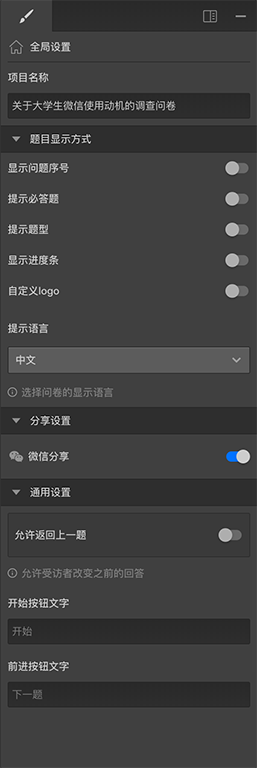

# 全局设置

当画布中不选中任何内容时，右侧编辑栏显示的是该问卷的全局设置。

> 在更改设置时，可以配合使用[实时预览](../preview/realtime.md)和[完整预览](../preview/full.md)来查看效果。

## 项目名称
该问卷的名称，在dashbord页面的问卷列表中显示的也是该名称。

## 题目显示方式
里面包含一些开关设置，这些设置会影响到答题页面的显示内容。
+ 显示问题序号：开启后在答题页面会显示序号，使受访者知道当前是第几题。
+ 提示必答题：开启后必答题的题目前面会显示一个`*`号。
+ 提示题型：开启后，题目中会显示该题的类型。
+ 显示进度条：开启后，答题页顶部会显示进度条，代表当前答题进度。
+ 自定义logo：开启后，可以设置自己的logo文字和图标，答题完成后的结束页面中会显示自定义的logo文字和图标，如果不开启设置则会默认显示巧思的logo。
+ 提示语言：选择在答题中的系统UI语言和提示消息语言。

## 分享设置
+ 微信分享：仅对于微信答题者有效，开启后，微信中可以分享该问卷链接，否则微信中不会显示分享按钮。

## 通用设置
+ 允许返回上一题：开启后，在答题页会有返回上一题的按钮，使得受访者能够返回之前的题目对答案进行修改。
+ 开始按钮文字：自定义答题首页开始按上的显示文字。
+ 后退按钮文字：只有开启允许返回上一题是才能设置，自定义返回上一题按钮上显示的文字，（在许多UI规则中可能由于屏幕较窄，会忽略该文字）。
+ 前进按钮文字：自定义下一题按钮上显示的文字。

> 这些按钮文字都可以不设置，这样就会使用系统默认的文字。

