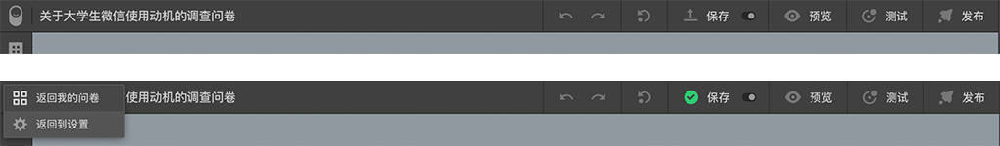

# 顶部工具栏

最左边的是巧思logo，点击该logo后会出现个选择列表，点击列表项可以返回到`我的问卷页面`或者跳转到`问卷设置页面`，如果点击的同时按住`Alt`键，则会在浏览器中新开标签打开目标页面，否则会在当前标签中打开目标页面。

logo右边是问卷的名称

右侧有一系列按钮，鼠标覆盖上去会出现提示文字，以下说明：

> 这些工具条所提供的操作，大部分都能通过快捷键来实现，如果你喜欢使用快捷键，请参照[快捷键及操作技巧](../shortcut/concept.md)，对于不喜欢快捷键的人则可以点击这些按钮来操作。

## 撤销
点击后撤销之前的操作

## 重做
点击后重做之前的操作

## 版本
鼠标覆盖后弹出版本操作弹框，详情请参照[问卷版本](../advance-topic/version.md)

## 保存
点击后保存问卷，问卷未保存和已保存下该按钮的图标的状态是不一样的，

## 自动保存
点击后开启/关闭`自动保存`功能，开启该功能后，每隔三分钟会自动保存一次问卷，以防止意外关闭而导致最新数据丢失。

## 预览
点击后打开预览弹框，详情请参考[预览](../preview/concept.md)

## 测试
点击后打开测试结果弹框，详情请参考[测试](../advance-topic/debug.md)

## 发布
鼠标覆盖后弹出快速发布弹框，详情请参考[快速发布](../advance-topic/quick-publish.md)