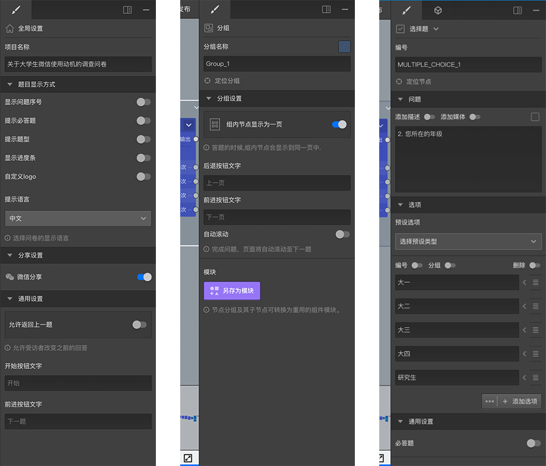

# 右侧编辑栏

右侧编辑栏是最常用语对问卷内容进行编辑的地方，不同的场合下会展示不同的可编辑内容，总体上来说包含顶部的tab栏和缩放按钮，和下面的编辑器。

点击tab栏按钮可以用语切换不同的编辑面板，点击展开按钮可以让编辑面板变宽，收起按钮可以让编辑面板隐藏起来。

当画布中没有选中任何内容时，编辑栏中会显示全局设置内容，可以对问卷的一些全局设置进行更改，具体参照[全局设置](./global-setting.md)。

当画布中单选了某个节点组时，编辑栏中会显示该组的设置内容，具体参照[节点组与模块](../groups/node-groups.md)

当画布中单选了某个节点时，编辑栏中会显示该节点的设置内容，不同类型的节点这边展示的内容会有些差异，这些设置会在[节点设置](../node-setting/concept.md)详细摊开讲解，选中节点时的编辑器一般会包含多个tab，点击上面的tab按钮来切换编辑栏内容，一般来说前面的tab中展示的是常用的设置，后面的tab中展示的是更不常用的设置。
