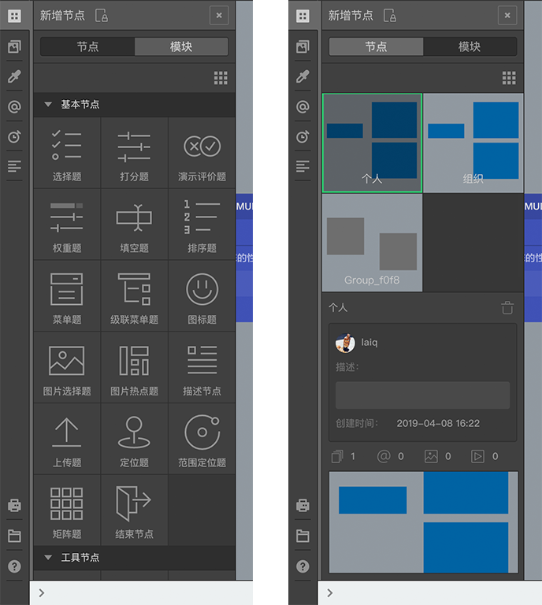
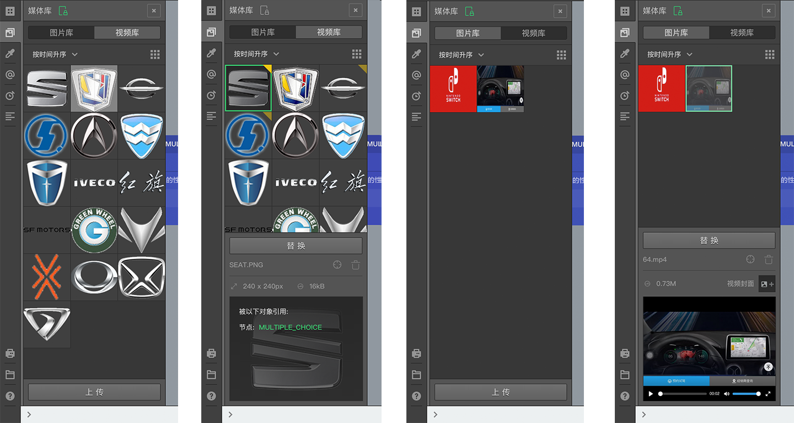
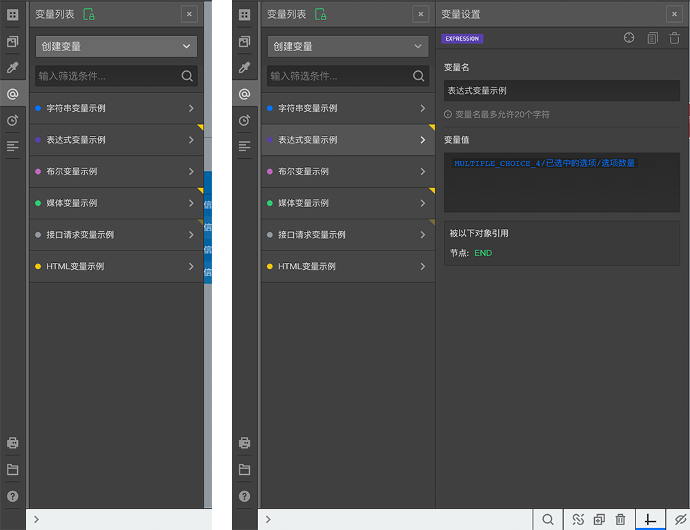
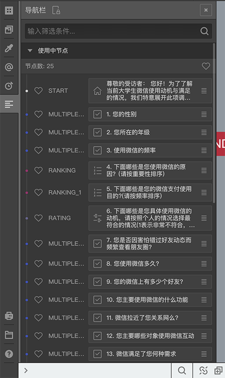

### 左侧工具条

左侧工具栏上有一排图标按钮，鼠标覆盖按钮后会出现提示文字，点击按钮后会滑出具体的操作区域
从上到下依次是：
1. 新增节点
2. 媒体库
3. 主题
4. 变量库
5. 计时器
6. 导航栏

7. 打印问卷
8. 文件操作
9. 帮助

前面6个按钮被点击后会从左侧滑出对应的功能区，但是同时只能滑出一个，功能区的头部包含一个锁定按钮和关闭按钮(参照后面的图片)，
如果锁定按钮没有被激活，则点击其他区域，如果画布，右侧编辑栏等的时候，该功能区会自动关闭，如果锁定按钮被激活，则该功能区会一直存在，直到主动点击了关闭按钮或打开了其他左侧栏功能区，

#### 新增节点

点击新增节点按钮，会滑出新增节点库界面,其中包含`节点`和`模块`两个功能区，可以通过点击上方的tab按钮切换

节点库主要用来新增节点。

在节点区域，包含基本节点和工具节点两个栏目，基本节点区内的节点时各种题型，工具节点中的节点一般不作为题目，而是提供辅助的功能，点击某个节点，就可以在画布的左上方新加一个该类节点，如果想将节点加到画布中指定的位置，不要点击，而是按住鼠标左键将该节点拖动到画布的指定位置后释放鼠标即可。

> 各节点的具体功能请参照[节点种类](../nodes/concept.md)

在模块区域，可以新加模块和使用已有模块，模块是一堆已编辑好的节点的集合，有时候，因为某些题目的组合经常在不同的问卷中都会被使用到，我们可以把这一堆题目节点存储为一个模块，之后，在同一账号或统一组织下的所有问卷中打开模块区域，都能看到之前存储下来的模块，其封面就是包含节点组的缩略图，拖拽某个模块到画布区域再释放，就能将该模块添加到当前问卷中。

一开始默认是不存在任何模块的，自己可以保存一些模块，

> 关于模块的保存，请参照[节点组与模块](../groups/node-groups.md)

点击模块可以选中该模块，选中后下方会呼出一个信息栏，标明了该模块的一下信息：输入个人或组织，其创建者，创建时间，包含的节点数量，变量数量，图片数量，视频数量，点击信息栏做上方的删除按钮，可以删除该模块。

> tab按钮下方有一个网格按钮，点击后可以选择列表的排列方式

### 媒体库

点击媒体库按钮，会滑出媒体库界面，其中包含`图片库`和`视频库`量个区域。

媒体库主要用来管理当前问卷中用到的媒体资源。

新建的问卷默认没有图片和视频，可以点击下方的`上传`按钮上传对应的媒体文件，也可以通过将媒体文件拖拽进来释放的方式上传媒体文件，如果文件内容较多，上传按钮上会显示上传进度，媒体文件都上传完成后，会显示在列表中，选中一个媒体资源后，下方会滑出该媒体资源的详细信息栏，同时按钮也变成了`替换`按钮，此时重新选择一个媒体文件上传，将会替换当前的媒体文件。

媒体文件可以在`节点`和`变量`中使用，被使用过的媒体文件的右上角会有一个三角形标记，如果三角形是半透明的，则说明该媒体文件虽然被使用了，但是使用它的对象（如节点或变量）并没有被使用，在详细信息栏中鼠标覆盖右上角的三角形，就可以看到该媒体资源被哪些对象引用了，点击对象名称，将会定位到该对象。

配合Ctrl,Shift键点击列表可以选择多个媒体资源。

> 关于媒体的使用方法参照[图片的使用](../media/image.md)和[视频的使用](../media/video.md)

> 关于节点中使用图片请参照[问题设置](../node-setting/question.md)，[图片题](../nodes/picture.md)，[演示评价题](../nodes/slide-rate.md)，[图片热点题](../variable/usage.md)等

> 关于媒体在变量中的使用请参照[媒体变量](../variable/media-type.md)

点击详情栏中的瞄准图标，可以定位当前媒体文件在列表中的位置，这个操作在媒体文件较多，而且当前媒体文件不再滚动条可是区域内容是非常有用，点击旁边的删除图标，则会删除该媒体资源，如果该媒体资源被其他对象引用了，则删除之前会弹出确认框。

对于视频资源，会默认使用视频的首帧作为缩略图，也可以自己重新选一张图片作为缩略图；视频刚上传完成时，可能正在解码而无法观看，等解码完成后，在详情栏里可以观看该视频。

### 主题

点击主题按钮，会滑出主题库界面，包含`模板`和`样式`两个区域，模板包含`预设模板`和`我的模板`。

主题库主要用于设置和管理问卷的样式。

样式区域可以对答题也的样式进行控制，设置颜色，字体，背景图片等，模板区域区域放了一些已配置好的样式方案，点击某个模板，就会将该模板的样式方案应用到下面的样式区域，之后也可以在此基础上自行调整某个控制项，

预设模板是系统内置的一些样式方案，只能使用不能更改，如果自己调配了一套方案觉得希望以后再多份问卷中重复使用，则可以点击tab按钮切换到`我的模板`区域，在点击`+`按钮，将当前方案保存起来，也可以点击右侧的三个点按钮后弹出的删除按钮，删除当前选中的模板，

> 关于我的模板的保存功能，请参照[节点组与模块](../groups/node-groups.md)

> 关于问卷样式的具体控制技巧，请参照[主题与样式控制](../theme/concept.md)

### 自定义变量

点击自定义变量按钮，会滑出变量库界面，

变量库用于创建和管理问卷使用到的显式变量。

点击`创建变量`，然后选择一个变量类型，就能添加一个变量，在滑出的变量设置栏中可以添加变量名和变量值.

点击列表中的某个变量，右侧变量设置栏中就会展现该变量内容，右上角的三个按钮分别能定位变量，复制变量和删除变量，

变量可以在节点中使用，也可以被其他变量再次使用，被使用过的变量列表项的右上角会有一个三角形标记，如果三角形是半透明的，则说明该媒体文件虽然被使用了，但是使用它的对象（如节点或变量）并没有被使用，选中这种变量后，右侧滑出的变量设置栏中会显示被那些对象使用了，点击对象名称，将会定位到该对象。

在列表中拖拽变量项目可改变其在列表中的位置，配合Ctrl,Shift键点击列表可以选择多个变量。

> 变量是设计一些高级复杂问卷时的利器，但要使用好它则必须先学习一下变量的详细规则和概念，如需了解，请参照[变量栏目](../variable/concept.md)里面的完整说明。

### 计时器
点击计时器按钮，会滑出时间设置栏界面，

时间设置栏主要用于控制问卷及每道题的答题时间。

在设置栏的全局设置中可以设置整个问卷的最大答题时间和最小答题时间，在下面的题目列表中则可以精准控制每道题目的答题时间，

> 时间设置会对问卷的数据收集造成一定影响，关于时间设置的具体用途，请参照[时间设置](../timing/concept.md)

通过点击题目列表上方的小闹钟图标，可以打开时间统计栏，在这一栏里面可以根据多位预览者提交的回复时间样本，通过自定义排除，最大最小排除，然后求平均值来推测某个道题的平均合理时间，然后一键引用到每道题目。

> 关于预览时间样本，请参照[完整预览](../preview/full.md)

> 一般只有对时间非常敏感的问卷或题目才需要使用时间设置，普通问卷使用时间设置可能会弄巧成拙，请谨慎使用。

### 节点导航栏

点击导航栏按钮，会滑出节点导航栏界面，

节点导航栏中会列出已使用的节点和未使用的节点，可对节点标星，一键删除未使用节点，拖拽每隔题目右边的列表图标可以改变题目的次序，这个次序将会成为问卷结果展现时的题目的默认顺序。

### 其他

打印问卷按钮点击后会打开问卷打印预览页面，具体参照[问卷打印预览](../preview/print.md)。

文件导出导入按钮中可以导入或导出问卷，具体参照[问卷导入导出](../advance-topic/import-export.md)。

帮助按钮中包含跳转到一些常用帮助的链接。