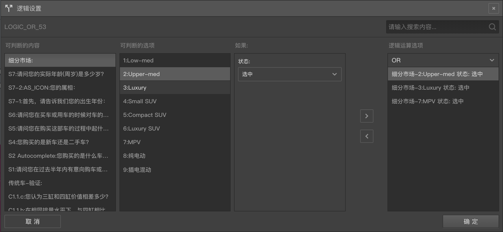
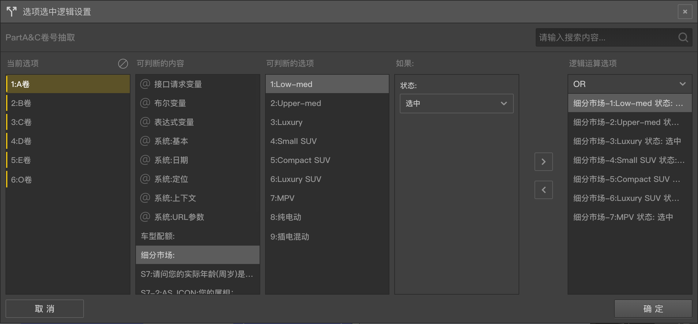

# 逻辑编辑器

问卷编辑器内置可以编辑逻辑运算条件，在答题过程中每个逻辑运算条件可以运算出一个`真`或者`假`的结果。

多个逻辑运算条件又可以通过`逻辑与(AND)`和`逻辑或(OR)`的组合运算来决定最后的运算结果。当使用`逻辑与`时，所有条件都为`真`，总结果才为`真`，当使用`逻辑或`时，只要有任意条件的结果为`真`，总结果就为`真`。

答题程序会根据运算出的结果决定后续不同的行为，达到逻辑控制的效果。

逻辑编辑器就是用来编辑逻辑运算条件的。

以下几个功能中会用到逻辑运算，在各自的功能区都有打开逻辑编辑器的按钮。
+ 针对节点：[逻辑节点](../nodes/logic.md)
+ 针对节点：自定义验证中的[逻辑验证](../node-setting/custom-validation.md#内置逻辑验证)
+ 针对选项：[选项显示控制](./opt-display.md)
+ 针对选项：[选项选中控制](./opt-auto-select.md)

从哪个节点的设置总打开逻辑编辑器，我们就把这个节点称呼为逻辑编辑器当前的`目标节点`。

下面分别对`针对节点`和`针对选项`两种情况来说明逻辑编辑器的使用

## 针对节点
针对节点的逻辑控制编辑编辑器如图：

编辑器中包含4列，第三列和第四列中间有两个按钮：`左移按钮`和`右移按钮`，左边三列是`条件选择组合列`，第四列是已添加的`逻辑条件列表`，点击`右移按钮`把左边已选好的`条件组合`添加到右边成为一条`逻辑条件`，点击`右移按钮`移除右侧已选中的`逻辑条件`项。

第一列：`可判断的内容`列，表示顶级内容，这个来源可以是节点，变量，在这里会列出所有针对`目标节点`可用的节点和变量类型组(包括系统内置变量组与按变量类型分的字符串，表达式，布尔自定义变量等)，点击某一项后会触发第二列中展示该项的包含的字内容。

第二列：`可判断的选项`列，表示二级内容，如果第一列中选中了变量组，则这里会显示该组下的具体变量，这些变量可能是系统内置变量或是在[变量面板](../layout/toolbar.md#自定义变量)中手动添加的变量；如果第一列中选中的是节点，则这里会展示该节点下面的选项。选中该列中的某一项后，会触发第三列总显示条件控制规则。

第三列：`如果：`列，表示要在这一列中对之前选择的顶级内容下的二级内容施加计算规则，根据内容的性质不同，这里可用的计算规则也会不同，罗列如下：
+ 如果目标是布尔变量或接口请求变量：这里会显示一个`结果为真`的条件，且无法更改，代表如果选中的布尔变量或接口请求变量计算结果为真，则这个逻辑条件的结果也为真，否则为假。
+ 如果目标是选择题的选项，则这里会出现一个包含`选中`和`未选中`的下拉列表，比如使用`未选中`，则代表选择题的这个选项没有被选中时，这个逻辑条件的结果就为真，否则为假。
+ 如果是其他类型的目标则会出现一个复杂`逻辑判断规则`，可以判断目标的`输入值`，`分值`，`排序号`，`取值`是否满足指定的`逻辑判断规则`，如果满足，则这个逻辑条件结果为真，否则为假
  > 请参照[逻辑判断规则](./opr-rule.md)

前三列都已经准备好后，点击`右移按钮`就会把逻辑条件应用到右侧的列表中。

可以往右侧添加多个条件，多个条件可以根据`逻辑与(AND)`和`逻辑或(OR)`的组合运算来决定最后的运算结果，点击第四列逻辑条件列表上方的下拉列表可以选择`AND`或`OR`。

设置完城后点击确定按钮就能将这些逻辑控制引用到`目标节点`，点击取消按钮或直接关闭窗口，将不会应用编辑。

对于逻辑节点，应用后的条件列表会在其右侧编辑栏的逻辑设置中罗列出来，答题时，逻辑运算结果真，会走逻辑的`Y`输出口，否则会走`N`输出口。

对于题目的自定义验证，应用后的条件列表会在其右侧编辑栏的自定义验证中的内置逻辑验证区域罗列出来，当答题时，如果逻辑运算结果为`真`，该题的自定义验证就会通过，否则不会通过。

> 上图中，要求题目`细分市场`下的三个选项`Upper-med`、`Luxury`、`MPV`中的任意一个选项选中，逻辑运算结果就会为真，否则为假。

## 针对选项
针对选项的逻辑编辑器如图：

`针对选项`的逻辑编辑器，比`针对节点`的在左边会多出一个选项列表栏，点中列表中的选项后，可以分别对每个选项都可以添加逻辑条件。

设置过逻辑条件的选项会变成黄色背景，多选中选项，点击选项列表上面的清除按钮可以批量清除这些选项上的逻辑条件。

其他操作和针对节点的时候一样。

引用了逻辑条件以后，对应选项的左侧会出现带颜色的小图标，触发逻辑编辑的按钮上的图标也会带颜色。

对于`选项选中控制`的场合：如果该选项逻辑条件计算结果为真，则这个选项在答题也中会自动被选中，否则不会被选中
对于`选项显示控制`的场合：如果该选项逻辑条件计算结果为真，则是个选项会被显示出来，否则该选项不会被隐藏

> 对于没有设置过控制规则的选项，不会被自动选中，也不会被隐藏。