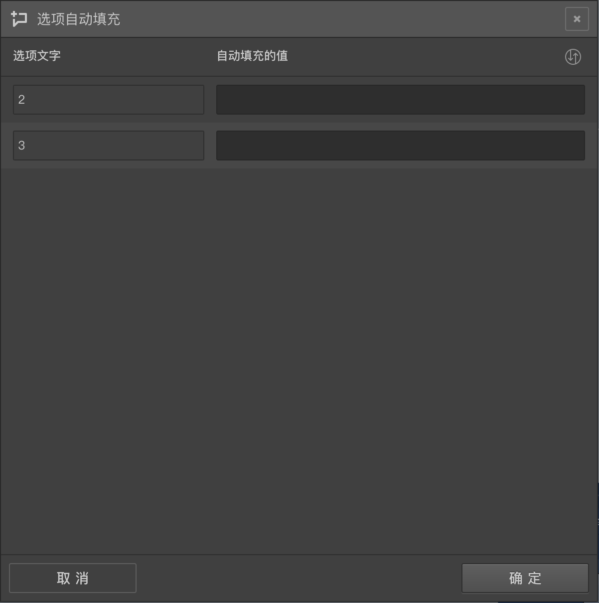

# 选项自动填充逻辑控制

一般输入类型的题目展示后会等待用户打分，或输入文字，不过也可以通过设置自动赋值的功能，让某些选项一开始就被赋予指定的内容。

在选项的[高级控制](../node-setting/option.md#高级控制)按钮组中点击`自动赋值`，
就能打开选项自动填充面板，在面板中，每个选项对应一个输入框，再输入框中输入好内容，答题时该选项就会自动被填上这个值；如果输入的是变量，则会解析出该变量的真实内容填充到这个选项。

> 点击输入框右上的`批量应用`按钮，就能将第一个选项的值应用到全部选项上面。

是不是感觉这个功能没什么用呢？确实大部分时候用不到这个功能，如果一道题是让用户去输入的，系统自动给输入一个值，意义不大。

## 埋点

这个功能常用于问卷设计中进行`埋点`，这个点常见就是一个填空题或打分题，给它的选项们都设置了自动填充的内容，一般情况下这个内容是个变量，变量的结果是在之前的若干题目的回复内容上结合某些算法算出来的，同时被设置为[替身节点](../node-setting/advanced.md)模式，这样该题就不会答题过程中显示，但是它的选项会被自动填充一些内容，并且当成答案提交，在分析答案时候可查看该`埋点`的内容来校验答案或总结重点。

这个`埋点`中被自动填充的内容在问卷设计的过程中又可以当成变量被后续的节点所引用。

