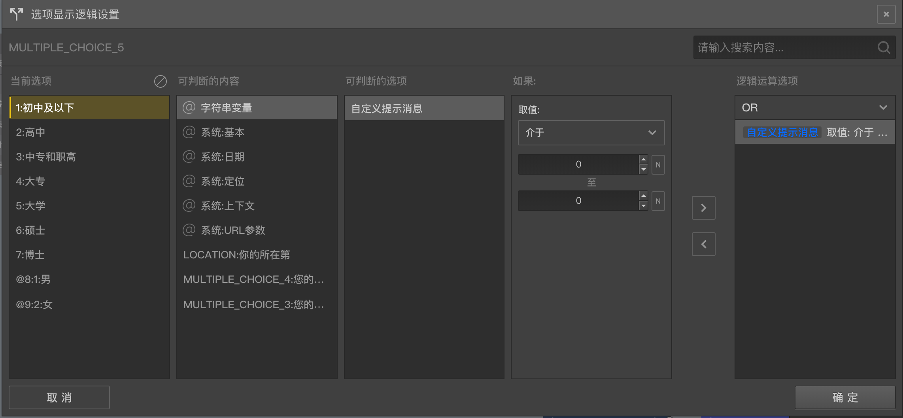

# 选项显示控制逻辑

一般题目的选项都会全部显示出来，但是通过设置选项显示功能可以控制某些选项显示与否。

在选项的[高级控制](../node-setting/option.md#高级控制)按钮组中点击`显示控制`，就能打开`选项显示逻辑控制`的[逻辑编辑面板](./logic-editor.md)，按编辑面板的操作规则设置好逻辑条件就可以控制选项的是否可以显示。

没有设置过任何显示控制逻辑的选项默认都是会显示的，设置的显示控制逻辑的选项，只有逻辑条件计算结果为真时，才会被显示出来，否则会被隐藏起来。

选项显示控制常用来控制保持前后题目的的逻辑一致性，也可以用于自定义的控制。

> 前后逻辑一致性例子可参照[逻辑概述](./concept.md)中关于个人收入和家庭收入的列子。

