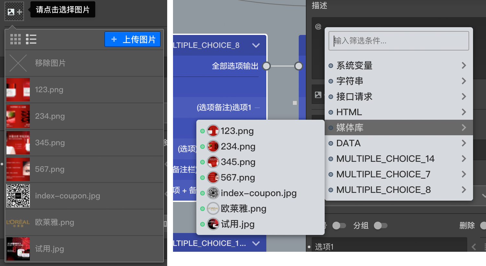

# 图片资源

图片的上传和管理在[媒体库](../layout/toolbar.md#媒体库)中有过详解。

这里讲述图片资源的使用，图片资源允许以两种方式被使用

+ 普通设置方式
+ 富文本框内嵌方式

## 普通设置方式
大部分能通过设置使用图片的地方，都会放置一个图片选择器，点击这个图片选择器就会出现个列表，列表中会展示当前媒体库中的所有图片，点击某项可以选择图片，如果问卷中创建过媒体变量，则当前编辑节点能访问到的媒体变量也会在列表的末尾列出以供选择，点击第一个`X`按钮则可移除当前被选中的图片，如果媒体库中还没有你想要的图片，则点击选择题右上的`上传图片`按钮可以快速上传一张并使用到该处，同时这样图片也会添加到媒体库中。

主要在以下几个设置中可以以普通设置方式引用图片：
+ [问题设置](../node-setting/question.md)
+ [图片题](../nodes/picture.md)和[演示评价题](../nodes/slide-rate.md)的选项中
+ [图片热点题](../nodes/hot-spot.md)的热图设置中
+ [问卷封面](../nodes/start.md)设置中
+ [全局设置自定义logo](../layout/global-setting.md)
+ [抽奖节点](../nodes/lottery.md)的中奖描述和未中奖描述中
+ [视频库](../layout/toolbar.md#媒体库)中充当某个视频的封面

## 富文本框内嵌方式
富文本框是指获得输入焦点后边框显示为紫色的输入框，这些输入框中可以以内嵌的方式引用变量，在输入框中输入`@`符号，就会出现变量选择列表，媒体变量和媒体库中的图片在这其中也可以被找到，点击找到的某个媒体项目，就能将这个媒体资源当变量内嵌到文本框中，答题页中会解析出该媒体变量代表的媒体资源并显示出来。

> 有些富文本框中是无法使用媒体变量的。

> 关于变量使用的详细攻略，参照[变量使用](../variable/usage.md)章节

