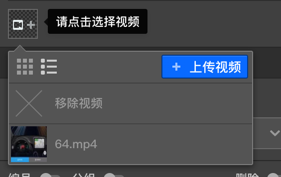

# 视频资源

视频的上传和管理在[媒体库](../layout/toolbar.md#媒体库)中有过详解。

视频只能在节点的[问题设置](../node-setting/question.md)中使用.其中会放置一个视频选择器，点击这个视频选择器就会出现个列表，列表中会展示当前媒体库中的所有视频，点击某项可以选择视频，点击第一个`X`按钮则可移除当前被选中的视频，如果媒体库中还没有你想要的视频，则点击选择器右上的`上传视频`按钮可以快速上传一个并选中使用，同时这个视频也会添加到媒体库中。
