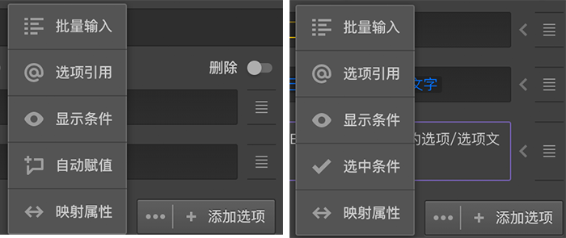

# 题目选项设置区

题目选项设置区用于设置题目的选项属性，不同题目的选项区可编辑的内容会有差异，例如：
+ 选择类型的题目需要多个选项以供受访者选择；
+ 打分类型的题目可能同时需要受访者对同一主题的各个方面进行评分；
+ 输入类型的题目也可能需要输入多项内容；

具体差异参见[题目类型](../nodes/concept.md)中说明。

## 预设选项
系统提供了一些预设选项集，点击打开列表从中选择合适的项目，可以快速生成选项。

## 选项编号
开启选项编号开关可以编辑选项编号。选项的编号只能是数值，且不能为空值，同一道题目的选项编号不能相同。选项编号可以在变量中引用。如果没有特殊需求，一般使用系统生成的选项编号即可。

## 分组编号
开启分组开关，就可以对选项分组号进行编辑，相同组号的选项为同一组，选项分组会在[选项随机](./option-random.md)中使用。如果没有特殊需求，一般不需要进行分组。

## 新增选项
新增加的题目一般会默认携带几个空选项，在选项输入框中输入选项名称即可。点击选项列表下面的`添加选项`按钮，可以添加一个空选项。
    > 当光标在某个选项输入中时，按下`Enter`键可以在该选项之后插入一个空选项。

## 选项排序
每个选项的右边都有一个拖拽图标，按住这个图标上下移动，可以对选项排序。

## 附加设置
有些选项的输入框和排序图标之间会有个小箭头图标，点击这个小图标打开该选项的附加设置。每种的题型的附加设置各有不同，有些题型没有附加设置，有些题型只有满足某些条件下才有附加设置，参见[题目类型](../nodes/concept.md)中的详细说明。
> 在附加设置中进行过设置的选项，无论是在选项编辑区还是画布中的节点方块中，对应选项的前面会有个小白点作为提示标记

## 批量编辑选项
在画布中双击某个题目，可以打开`批量编辑`面板，在批量输入框中一行就是一个选项，输入完成后点击确定，就会按行分成多个选项应用到题目中。

## 删除选项
开启选项列表右上方的删除开关，所有选项右侧的拖拽图标会变成删除图标，点击删除按钮就会删除该选项。再次点击删除开关，图表变回排序图标。

## 高级控制
很多题目的`添加选项`按钮的左边还有个三个点的图标。

点击这个图标会出现一个列表，列表中全部或部分地包含下列按钮：
+ 批量输入：点击后进入`批量编辑`面板，和双击节点的效果相同。
+ 选项引用：点击后添加`选项引用`配置，添加选项引用配置后，选项列表后面会展示引用配置的列表，具体参见[选项引用](../opt-reference/concept.md)。
+ 显示条件：点击后对选项的显示进行控制，具体参见[选项显示控制](../logic/opt-display.md)。
    > 设置过显示条件的选项，前面会有个小黄点标记
+ 选中条件：针对选择类型题目的设置，点击后对选项的自动选中进行控制，具体参见[选项自动选中控制](../logic/opt-auto-select.md)。
    > 设置过选中条件的选项，前面会有个小蓝点标记
+ 自动赋值：针对输入输入类型题目的设置，点击后设置选项的自动赋值内容，具体参见[选项自动赋值](../logic/opt-auto-input.md)。
    > 设置过自动赋值的选项，前面会有个小蓝点标记
+ 映射属性：点击后编辑选项的映射数据，具体参见[选项映射属性](../logic/option-mapping.md)。
    > 设置过映射属性的选项，前面会有个小紫点标记    
