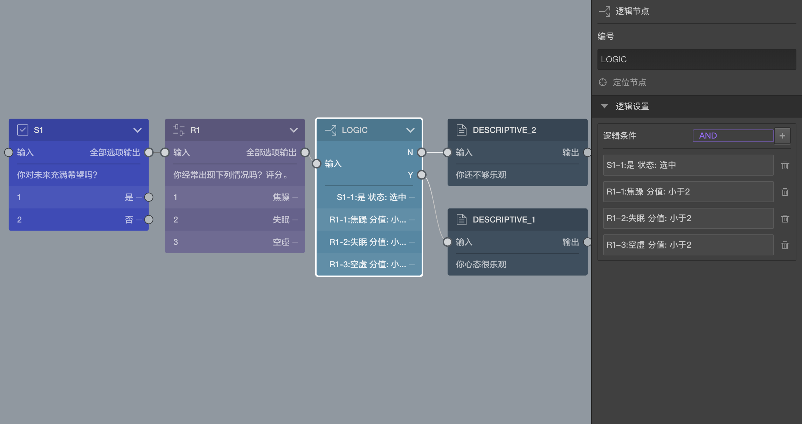

# 逻辑节点

> 不同题型或功能节点共有的通用设置在[节点设置](../node-setting/concept.md)中有讲解，此处只讲解逻辑节点能。

逻辑节点用来判断逻辑条件，从而控制问卷流程走向。

考虑这样的情形：我们要设计一份问卷调差人们的生活乐观度，首先我们会针对日常生活问一些简单的问题，然后我们要根据受访者回答的答案，决定这个人是属于乐观生活态度还是不够乐观的生活态度。

通过之前的文档，我们知道单选题的的选项可以输出连线，决定选中该选项后的去哪里找到下一题，实现问卷题目跳转的功能。但是如果变成多选题，或者对于填空题、打分题等，因为它们的答案不是只有一个选项的选中/未选中两种状态，无法通过连线解决。这类复杂的场景下，则需要用到逻辑节点，对题目的结果进行组合判断，从而决定下一题去哪里。

## 了解规则
逻辑节点在画布中会有两个输出口：`Y`输出口和`N`输出口。

逻辑节点中可以设置许多逻辑条件，每个逻辑条件都会计算得出最后为`真`还是为`假`。

多个条件之间组合时的`逻辑类型`分为`逻辑与(AND）`和`逻辑或(OR)`两种，当使用`逻辑与`时，所有条件都为`真`，总结果才为`真`，当使用`逻辑或`时，只要有任意条件的结果为`真`，总结果就为`真`。

根据`逻辑类型`整合多个条件的结果得出最终结果为`真`还是为`假`，当最终结果为`真`时，后续会走`Y`输出口的输出线寻找下一个题目，当最终结果为`假`时，后续会走`N`输出口寻找下一个题目。

通过点击右侧编辑栏中逻辑设置中的`+`号打开[逻辑编辑面板]来编辑逻辑条件，`逻辑类型`也在里面选择,
当逻辑编辑面板设置好以后点击确定，这些条件就会应用到对应的逻辑节点上，并会显示到有些编辑面板中，`逻辑类型`则会显示到添加逻辑按钮边上。

## 结合案列
上图的问卷片段中，我们调查人的生活态度，第一道选择题询问是否对未来充满希望，第二道打分题分别对三个症状在自己身上出现的频率进行打分，分值越低的代表出现频率越低，然后通过一个逻辑节点来整合之前的回答情况，从而得出结论，

结合观察右侧编辑面板，里面包含了四个条件，
1. `S1`中选中`是`
2. `R1`中`焦虑`项评分小于`2`
3. `R1`中`失眠`项评分小于`2`
4. `R1`中`空虚`项评分小于`2`

里面使用的逻辑类型是`逻辑与(AND）`，也就是当上述条件都满足时，这个逻辑节点的最终运算结构为`真`，下一题从`Y`输出口寻找到`DESCRIPTIVE_1`将显示`你心态很乐观`；否则为`假`，下一题从`N`输出口寻找到`DESCRIPTIVE_2`将显示`你还不够乐观`。

> 如何设置上面四个条件？参照[逻辑编辑面板](../logic/logic-editor.md)

> 使用逻辑节点是通用的问卷分支流程控制方法

> 单选选择题，有目标的排序题等某些题目自己的选项可以快速决定去往的下一题题目，也达到问卷分支流程控制，其实这只是快捷方式，用逻辑节点同样可以实现这样的功能，这个可以自己动手试试，可参照[逻辑编辑面板](../logic/logic-editor.md)

> 该功能节点在答题页中不会被显示
