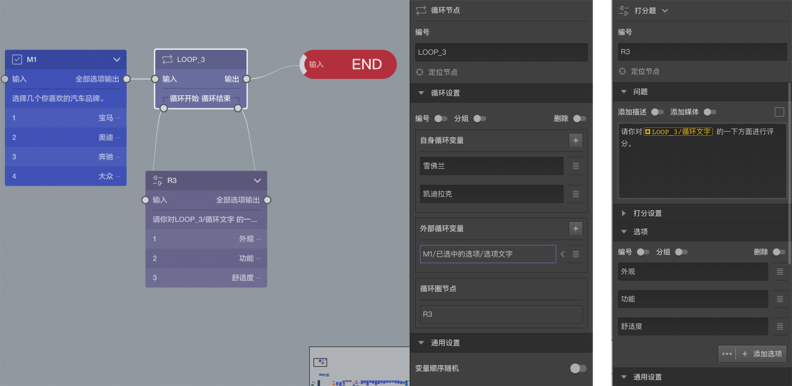

# 循环节点

> 不同题型或功能节点共有的通用设置在[节点设置](../node-setting/concept.md)中有讲解，此处只讲解循环节点特有的功能。

循环节点用来控制在不同的条件下重复做一些题目，达到减少题目数量，简化问卷的目的。

## 案例
考虑这样的情形：一份关于汽车的调查，我希望调查被访者对通`丰田`，`雷克萨斯`两个品牌的`外观`，`功能`，`舒适度`三个方面的印象。为了达到与其他品牌横向对比效果而插入一些其他汽车品牌，也对他们询问这三个方面的印象。由于插入的品牌会非常多，如果对所有的品牌都问一遍同样的问题，问卷题目会变得非常多，影响被访者的体验，所以打算让被访者先从大量的品牌中选择几个自己关注的品牌作为被混入的品牌，以减少题目数量。

从上面的需求可以看到最核心的题目就是询问三个方面印象的题目，只是该题要被询问多次，除了`丰田`，`雷克萨斯`是确定要问的，其他会被问到的品牌数量是不确定的。

由于要询问的品牌和次数都源自于被访者在上一题中的选择结果，因此在问卷设计阶段无法准确预知，所以用常规的方法和功能设计上面的题目会遇到无法解决的困难。

## 基本规则

在画布中，循环节点除了输入口和输出外，底部还有一个循环开始和循环结束口。
+ 循环开始是一个输出口，可以输出到另一个节点。
+ 循环结束是一个输入口，可以接受其他节点的输出。

具体使用方法是从循环开始输出到一些题目，这些题目的最后输出又会作为输入连接到循环结束，这样就实现了一个循环。循环开始和循环结束之间的节点被称为`循环圈节点`。

打开属性编辑栏，可以看到循环节点上可以设置[循环变量](../variable/loop-type.md)，包含`自身循环变量`和`外部循环变量`两种。
+ `自身循环变量`是在循环节点身上设定好的，是固定的。
+ `外部循环变量`是从之前的题目中引用过来的，是动态的。
> 其实自身循环变量与外部循环变量的关系，等同于题目中的选项与[引用选项](../opt-reference/concept.md)的关系。

答题过程中遇到循环节点时，会把循环节点的`自身循环变量`和`外部循环变量`（这时候已经由动态计算得出了固定结果）都取出来得到多个变量。系统会从中先拿出第一个，对`循环圈节点`中的所有题目询问一遍，问完后，又会拿出第二个，再对`循环圈节点`中的所有题目询问一遍，如此重复，直到所有变量都用完了，最后才会从循环节点的输出口继续后续的题目。

`循环圈节点`中的所有节点，都能使用[循环变量](../variable/loop-type.md)，代表每次重复对`循环圈节点`发问时使用的内容，这样就能达到虽然每次都是使用的同样的`循环圈节点`，但是每次展示的内容却不相同。

> 上图中第二个右侧编辑栏中，`R3`的问题文字中展示了循环变量的使用方法。变量使用方法参见[变量使用](../variable/usage.md)。

## 案例解决方案
上图的问卷片段中，第一道选择题M1从海量的其他品牌（简单起见，案列中只用了四个）中让用户选择一些自己感兴趣的作为后续混入的品牌；在循环节点LOOP_3中，自身循环变量设置了`雪佛兰`，`凯迪拉克`两项，外部循环变量使用了`M1/已选中的选项/选项文字`(这是[选项引用](../opt-reference/concept.md)规则，正是这一操作将之前受访者感兴趣的品牌混入了进来)，LOOP_3的循环圈节点只包含一个R3，R3的问题文字中引用了循环变量。

如果受访者在M3中选择了感兴趣的品牌是`奥迪`和`大众`，则循环圈节点分别会被询问四次，分别是：
1. 请你对`丰田`的以下方面进行评分。
2. 请你对`雷克萨斯`的以下方面进行评分。
3. 请你对`奥迪`的以下方面进行评分。
4. 请你对`大众`的以下方面进行评分。

## 变量循序随机
循环变量使用的顺序可被打乱，其打乱规则同[选项随机](../node-setting/option-random.md)

> 该功能节点在答题页中不会被显示

假设所有的条件和次数都是确定的，如：我们只调查`丰田`，`雷克萨斯`，`别克`,`大众`,`奥迪`这几个品牌，则我们重复添加五个结构相同的题目对三方面进行询问即可（问题文字会针对不同品牌而各不相同，但其他都是一样的），但是如果品牌数变成20个或更多，则需要复制20个题目，这样就不妙了。
