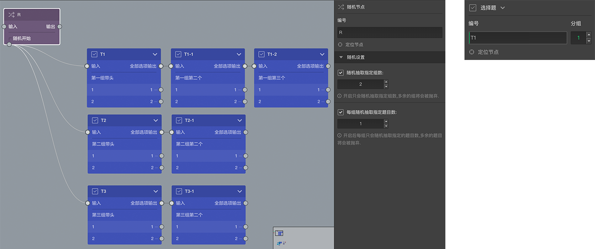

# 随机节点

> 节点和题目的通用的设置在[节点设置](../node-setting/concept.md)中有讲解，此处只讲解该节点或题目特有的功能。

> 在更改设置时，可以配合使用[实时预览](../preview/realtime.md)和[完整预览](../preview/full.md)来查看效果。

随机节点用来随机控制一些节点出现或不出现，以及他们出现的顺序。

在画布中，随机节点的底部有一个`随机开始`的输出口，这个输出可以输出多次，接在这后面的节点成为`随机组节点`，随机开始输出口输出多次会形成多个自然随机小组，每一组最前面的节点被称为`组头`。

随机节点的默认作用就是在答题过程中打乱这些自然小组的出现顺序。

如上图，随机开始输出了三次，形成了三个自然随机小组，每个小组可以包含任意题目数，答题的时候碰到这个这个随机节点时，系统会从这三个随机小组中随机抽出一个小组并问这些题目，当这个小组的题目问完后，会从剩下的小组中再抽出一组，如此重复，直到所有小组都抽完了，才会从随机节点的输出口去找后续的题目。
> 只能控制随机小组出现的顺序，不能随机控制小组内题目的顺序，这些题目的顺序已经是确定的，如果真想控制单独一道道题随机出现的顺序，可以考虑单独一个题当一个组。

除了随机控制小组出现的顺序，还可以随机控制出现的小组数量，以及每组随机出现的题目数量，这需要要右侧编辑面板中的随机设置中开启对应的控制开关
### 随机抽取指定组数
开启该项后可以在众多的随机组中抽取指定数量的一部分，其余的将会被丢弃。
》 如上图中，开启并设置抽取2组，则随机过程中另外的某一组将会被丢弃。
最大组数是自然小组的数量，但是还可以认为干涉，每个组的`组头`的右侧编辑面板中头部编号的右边会有一个分组输入框，在这里可以人为的为每个组设置分组编号，相同分组编号的多个自然随机小组，在随机抽取指定数量的时候会被看成是一组成为`实际随机分组`，当所有组头的编号都是默认的`N`时，实际随机分组的数量等于自然随机小组的数量，当某些组头的编号不是`N`且和其他某个些组头的编号相同时，实际随机分组的数量小于自然随机小组的数量。
> 如上图中，如果将第二组和第三组的的组头编号都设置为2，则实际随机小组的数量就会从3降为2，这时候又有小组又能全部不被展示了。

> `实际随机分组`只会在随机抽取组数时生效,虽然第二组和第三组被合并到了实际随机分组，但是它们谁先出现依然是随机的。

### 每组随机抽取指定题目数
开启后从每一`自然随机小组`众多的题目中随机展示指定数量的题目，其余的将被丢弃。
> 如上图中，设置了从每一组中随机抽取1题，则最终展示时第一组中有2题会被抛弃，2和3组中分别有一题会被抛弃，具体哪些题目被展示被抛弃是随机的，但最终肯定只有3道题目（每组一题）会被展示出来。

