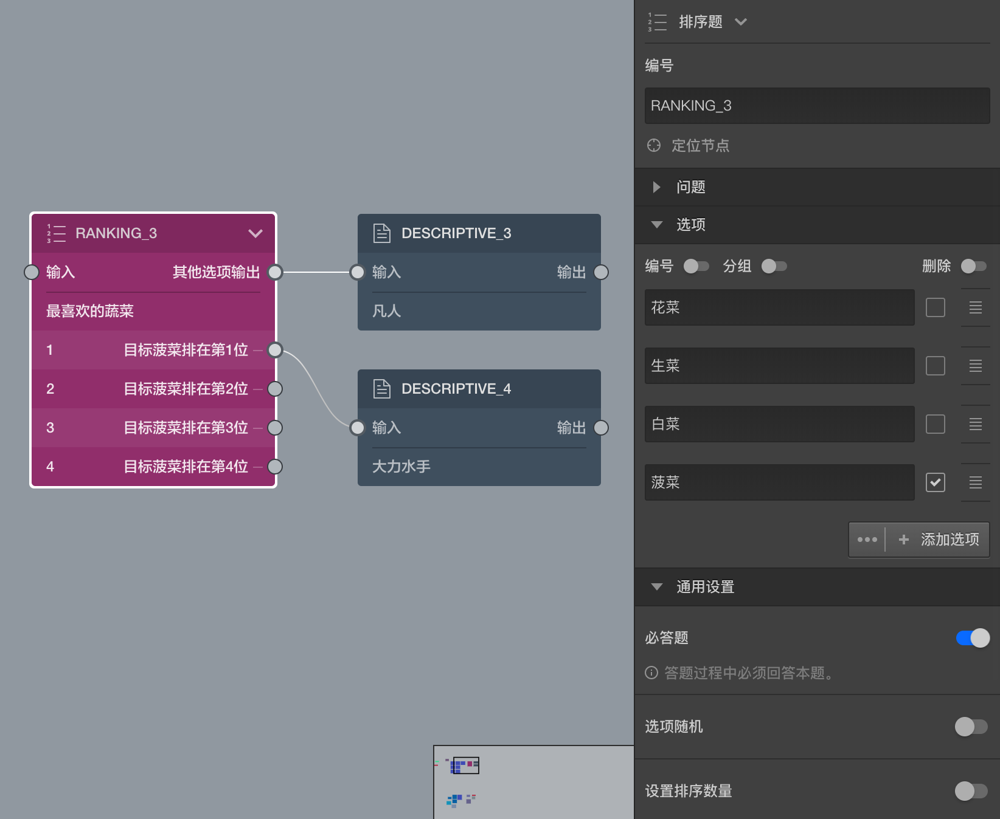

# 排序题

> 节点和题目的通用的设置在[节点设置](../node-setting/concept.md)中有讲解，此处只讲解该节点或题目特有的功能。

> 在更改设置时，可以配合使用[实时预览](../preview/realtime.md)和[完整预览](../preview/full.md)来查看效果。

排序题提供一堆选项，让受访者对他们排序。

### 排序目标
在画布中排序题的的选项默认没有输出口，在右侧编辑栏中每个选项中都有一个勾选项，开启后可以将该选项作为排序关注目标，这时候画布中的选项会出现输出口，和选择题的选项输出口不一样，这里的选项输出，是指如果排序关注目标被排到该选项所在的位置，就从这里出去找下一题。

如上图中，我们勾选了菠菜为排序目标，同时从第一个选项中输出到大力水手的描述节点，意思是说如果某个人将菠菜排在第一位，我们就说他是`大力水手`，否则会走总输出口到达`凡人`的描述节点。

> 同时只能设定一个选项为排序关注目标，如果想关注多个排序目标并决定后面的题目，则需要使用[逻辑节点](./logic.md)

### 设置排序数量
默认情况下，排序题要求所有选项的序号都排出来才能进行下一题，手动设置排序数量后，则达到改数量就可以下一题。