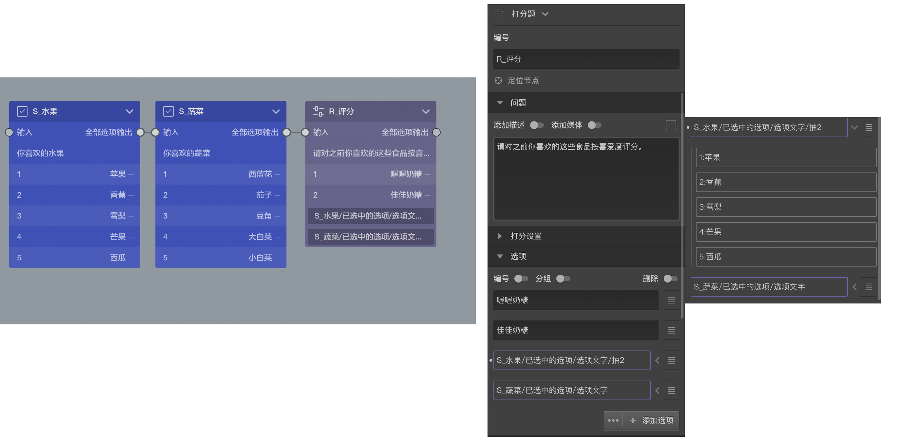

# 选项引用基本概念

题目出了可以自己添加指定选项之外，还能引用之前某些节点的某些选项，这就叫做`选项引用`，选项引用是通过变量来实现的，点击选项设置区中的[高级控制]按钮组中的`选项引用`按钮，就会打开[变量选择器](../variable/usage.md#变量选择器)，选择某个变量就会生成一个`选项引用`配置，通过这个配置可以生成若干个`引用选项`。

结合上图的实例进行说明：前两个多选题询问喜欢的水果和蔬菜，受访者可能分别选择若干项，第三题对一些食品进行打分，除了指定的两种食品外，还分别引用了前两题中受访者选中过的选项，后面这两个就是引用配置，通过使用`【S1_水果/已选中的选项/选项文字】`和`【S2_蔬菜/已选中的选项/选项文字】`这两个[隐式变量](./implicit.md)的方式来从前面两题引用(借用)选项。

`选项引用`配置设置好了就会为这道题生成引用选项，那到底会生成那些选项呢，大部分时候只有受访者答完前两道题才能知道。在编辑其中，会提前列出所有可能别引用到的选项，以供观察，点击`选项引用`配置右侧的小箭头，就会在`选项引用`配置的下方看到列出的所有可能被引用过来的选项，这些选项为区别自己自身的选项，被称为`引用选项`，如果普通选项可以进行[附加设置](../node-setting/option.md#附加设置)，那么`引用选项`也可以进项附加设置。

看完上面的的说明，相信已经明白了`选项引用`和`引用选项`这两个长得这么像的称呼的区别于关系了，`选项引用`是一个引用变量生成的引用配置配置，是手段，而`引用选项`则是是它的结果，是一堆选项项。

在上述例子中，如果受访者在第一题选中了`苹果`和`香蕉`，在第二题选中了`大白菜`和`小白菜`，则第三题中打分的时候就需要对`喔喔奶糖`,`佳佳奶糖`,`苹果`,`香蕉`,`大白菜`,`小白菜`,这六个项目进行选择。

`选项引用`配置还可以应用变量过滤器进行设置，点击这个配置项就会弹出`变量过滤器`，在其中可以设置过滤条件，如上图中的第一个`选项应用`配置末尾还有个`抽2`的描述，其实就是在`变量过滤器`中设置了随机抽取2个，这样的话如果第一题中了5个选项，则只会在其中随机拿出2个引用过来，而第二个题如果选中5个，则5个都会被引用过来。

还有跟多设置都可参考[变量过滤器](./filter.md)