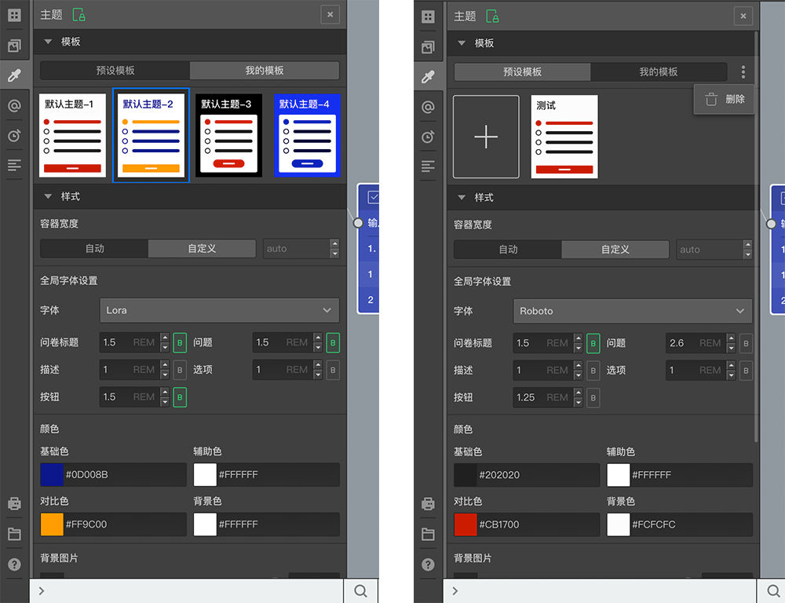

# 主题

点击左侧工具条的`主题`按钮可以打开主题设置面板。

包含`模板`和`样式`两个区域，模板包含`预设模板`和`我的模板`。

样式区域可以对答题也的样式进行控制，设置颜色，字体，背景图片等，模板区域区域放了一些已配置好的样式方案，点击某个模板，就会将该模板的样式方案应用到下面的样式区域，之后也可以在此基础上自行调整某个控制项，

预设模板是系统内置的一些样式方案，只能使用不能更改，如果自己调配了一套方案觉得希望以后再多份问卷中重复使用，则可以点击tab按钮切换到`我的模板`区域，在点击`+`按钮，将当前方案保存起来，点击右侧的三个点按钮后弹出的删除按钮，可以删除当前选中的模板，

> 在更改设置时，可以配合使用[实时预览](../preview/realtime.md)来查看效果。

## 模板
里面提供了默认四种主题模板，新建的问卷默认会使用第一个模板。
`我的模板`中可以将当前自己调配好的自定义样式配置保存为一个样式模板，以后后续再该账号下的其他问卷使用，如果当前属于某个组织，则还可以选择保存到组织下面，以后该组织下的所有问卷都能使用这个主题模板。

## 样式

选中某个主题后，可以对样式进行自定义控制，
### 容器宽度
可以控制答题页的有效显示内容的容器宽度默认是`auto`即自适应宽度，切换到自定义可以指定想要的容器宽度，仅在宽频终端中可以使用。

### 字体控制
可以设置问卷标题，问题，描述，选项，按钮文字的字体，字体大小，字体粗细，其中针对问题，描述，选项的字体设置会带动问卷中所有节点的这三个设置一起变化，除非某个节点中已自行进行过设置而进入了[隔离状态](../node-setting/layout.md#自定义字体尺寸)。

点击字体设置中的单位，可以更改字体使用的单位。

### 颜色
可以控制四个方面的颜色，具体颜色对不同内容的影响可以结合[实时预览](../preview/realtime.md)来观察效果，切记不要把背景色和字体颜色搞成相近的颜色，否则文字会难以识别。

### 背景图片
可以为答题页设置背景图片，选择完图片后还可以控制背景图片的透明度。

## 其他技巧
除了使用使用这些常规设置，还可以通过[HTML变量](../variable/html-type.md)注入自定义样式的方式来改变样式，这种方式更加灵活。

