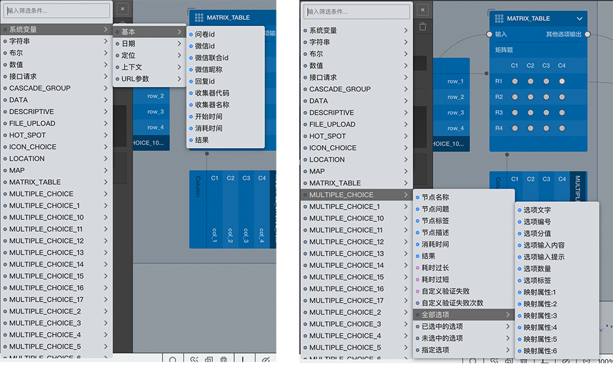

# 变量的使用

变量可以在系统的很多地方被使用：
+ 富文本框中
+ 选项引用中
+ 如果是媒体变量，则[图片选择器](../media/image.md)中也能使用

## 富文本框
富文本框是编辑器中获得输入光标后边框会变成紫色的输入框，这些输入框中可以插入变量，插入后的变量会以不同颜色的标签显示出来，以区别普通的输入内容。
获得光标后边框变成蓝色的输入框是普通输入框，不能插入变量。

## 变量选择器
使用变量需要用到变量选择器，在富文本框中输入`@`符号后或者在选项设置[高级控制](../node-setting/option.md#高级控制)按钮组中`选项引用`按钮后，都可弹出变量选择器。

请结合上图阅读下面的内容：

变量选择器中会列出当前位置所有可以使用的变量
> 变量存在不一定就可以被使用，什么地方能使用什么变量是有规则限制的，后面会有详细说明。

变量选择器第一层会列出系统变量，已有变量的变量类型分组，和所有的节点，鼠标覆盖在某个项目上面，就会列出这个醒目下面的子集变量列表，如果某个子集变量又包含更多的变量，则鼠标覆盖在其上又能看到里面的变量列表。

> 项目右侧带`>`符号的项目表示其内部包含更多的变量。

第一个项目是内置变量组，其内部包含所有的系统内置变量，具体内置变量包含哪些代表什么含义，请参照[内置变量](./build-in.md)

其后是几个`显式变量`组，这些按变量类型分类被分到多组中，每一组中都会包含在[自定义变量](../layout/toolbar.md#自定义变量)面板中添加过得对应类型的变量，如果某种类型的变量一个也没有，则这个组也不会显示出来。

在后面是节点列表，每个节点的身上都能抽出一堆变量，这些变量就是`隐式变量`，具体隐式变量包含哪些，不同的节点上能抽出哪些隐式变量，分别代表什么含义，请参照[隐式变量](../implicit.md)。

第一层中如果项目太多可以在顶部的筛选输入框中输入关键字进行筛选。

点击某个变量项目，这个变量就会被插入当富文本框中，这样就会完成在富文本框中使用变量的操作了，答题页中会将这个变量解析成真实的值。

比如可以在某个题目的问题文字中插入一个变量如上图中能够看得到的`【系统变量/基本/问卷id】`，再开启[完整预览](../preview/full.md)观察一下的话会发现这个变量标签被解析成了当前问卷的问卷id。

再比如可以在某个题目的问题文字中插入从之前的某个选择题中提取的变量`【MULTIPLE_CHOICE/全部选项/选项数量】`，再开启[完整预览](../preview/full.md)观察一下的话会发现如果前面这道题选中多少个选项，这个变量的值就会解析为这个选中的数量。

通过在问题文字，选项文字等的富文本输入框中插入变量可以着这些内容在答题的时候展示成动态内容。

除了展示部分的内容，很多非展示部分的内容也可以插入变量，如多选最大数，多选最小数，允许输入字符最大数等控制条件，当这些地方使用了变量时，在验证真实数量是否满足控制条件时，会先把控制条件解析出来具体的值，然后拿这些值再进行验证。

因为这些地方一般使用到了`数值拨动控件`，这里对这个控件专门介绍一下：

找到选择题的多选控制，开启后，会看到可以设置最大和最少数值，这里用到的就是`数值拨动控件`，在控件输入框的右边，会有两个上下箭头的按钮，点击这两个按钮或者光标在输入框内按下键盘上的上下方向键，就能以递增递减的方式修改输入框内的数值，如果同时辅以按住`Shift`或`Alt`键，递增递减的幅度会发生变化。当然直接在输入框中也可以输入值。

对于在某些地方使用的`数值拨动控件`，是可以使用变量的，这时候控件的右侧会有个小按钮，点击可以切换输入模式，当小按钮上显示`N`是普通的数值输入模式，当显示`V`时是变量输入模式，变成变量输入模式后，会展示一个`富文本框`，然后可以富文本框中插入变量的方式输入变量了。

## 选项引用中

节点出了自身添加选项以外，还可以从之前的节点引用选项，把之前题目的全部或部分选项内容拿过来当成自己的选项，这个行为叫做`选项引用`，选项引用是通过变量实现的。

> 并不是一定得应用之前题目的选项生成自己的选项，可以引用任何变量生成自己的选项，生成规则会在后面讲述。

选项设置[高级控制](../node-setting/option.md#高级控制)按钮组中`选项引用`按钮后，会弹出变量选择器，选择某个变量，就会在右侧编辑栏的选项设置面板中生成一个`选项引用`设置项，可以添加多个`选项引用`设置项，每个设置项会生成一个或多个`引用选项`，点击`选项引用`配置项右侧的小箭头按钮可以查看该配置项最多能狗生成多少个`引用选项`，且可以编辑这些`引用选项`的[附加设置](../node-setting/option.md#附加设置)。

那么`选项引用`和`引用选项`到时是怎么回事？这在[选项引用](../opt-reference/concept.md)章节中会详细讲解。

变量在富文本中插入后可以生成动态文字后动态控制条件，在选项引用总使用可以动态生成选项，这两点是生成一份动态问卷的关键。

