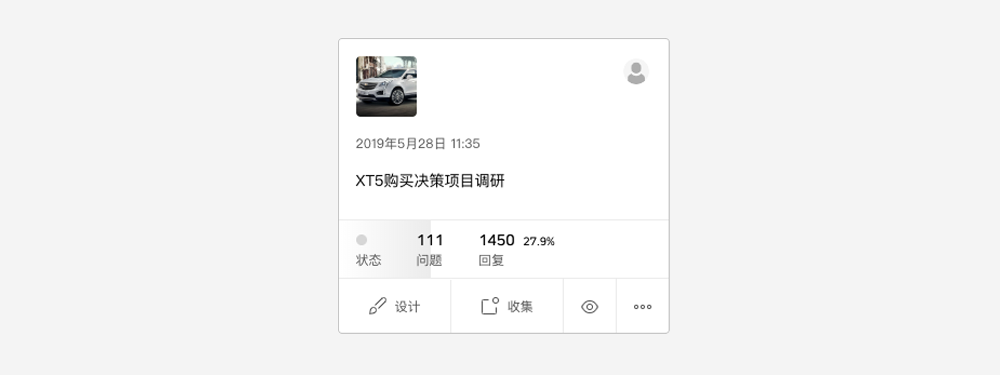

```index
1
```
```tag
问卷卡片 问卷管理
```
```summary
问卷卡片功能说明。
```
# 问卷卡片

问卷以`问卷卡片`的形式在管理器界面中展示，每张卡片对应一份问卷。

`问卷卡片`包含以下主要信息：



+ 问卷封面；
+ 问卷创建者信息；
+ 问卷最后编辑时间；
+ 问卷项目名称；
+ 问卷状态标记；
+ 问卷题目数量；
+ 问卷收到的数据总量和总占比；
+ 数据收集进度缩略图：如果最近一周收集到回复数据，鼠标点击`数据图标`后在问卷卡片上将显示最近一周的回收数据进度变化。

`问卷卡片`底部是`问卷卡片操作工具栏`，包含以下功能：
+ 问卷设计：在`问卷编辑器`中打开问卷。
+ 数据收集：进入`数据收集`页面。
+ 问卷预览：预览问卷。
+ 更多功能：点击打开更多功能，包含以下功能：
  + 收藏：收藏该问卷。
  + 配额：进入问卷`配额`页面。
  + 数据：进入问卷`数据`页面。
  + 复制：复制问卷。
  + 移动：把问卷移动到制定文件夹。
  + 迁移：把问卷迁移到制定团队。
  + 删除：删除问卷。