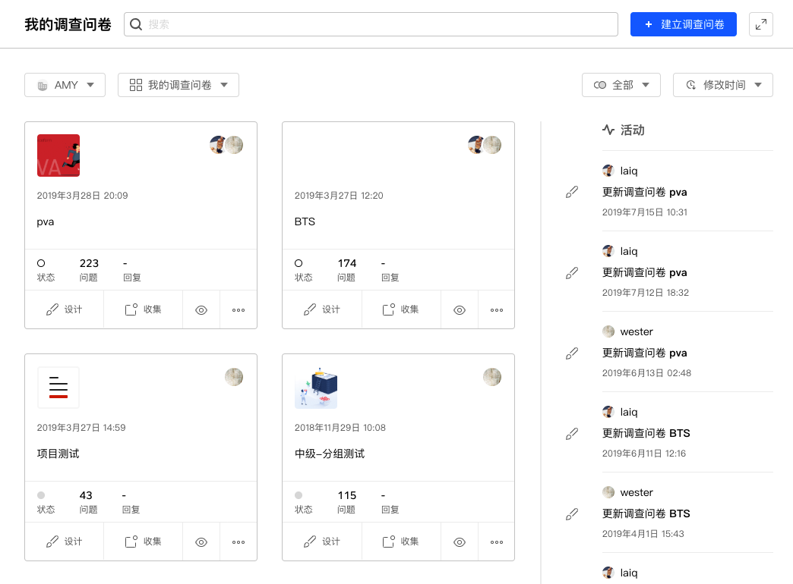

# 我的调查问卷

==我的调查问卷==是系统的问卷管理器，用于展示、管理用户当前账号或者团队组织的问卷调研项目。

+ [问卷卡片](./02surveyCard.md)
+ [问卷文件夹](./03surveyFolder.md)
+ [问卷筛选和排序](./04surveyFilterAndSorting.md)
+ [问卷搜索](./05surveySearching.md)
+ [切换账号和团队组织](./06team.md)