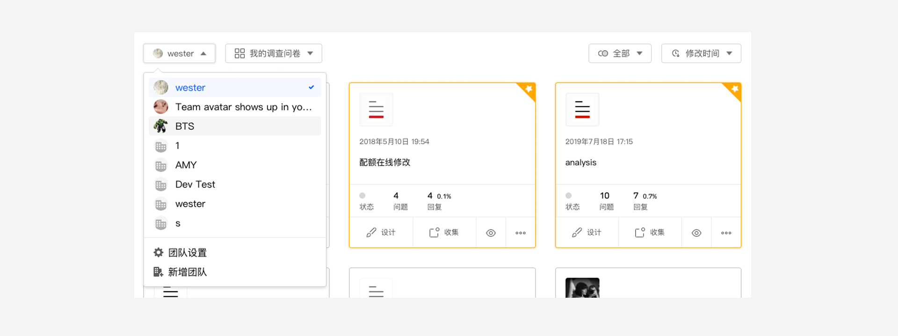

```index
6
```
```tag
切换账号 切换团队 团队协作 共享问卷 问卷管理
```
```summary
系统支持团队协作，加入团队，与同事们共享问卷、资源和数据，工作效率犹如坐上小火箭。
```
# 切换账号和团队组织

`问卷管理`页面左上角的`账号切换`下拉列表显示了当前用户账号，`问卷管理`页面中的问卷是当前用户账号的所有问卷。



当用户是团队的成员时，点击`账号切换`下拉列表，会显示当前用户所属的团队,一个用户可以属于多个团队组织。点击团队组织名称切换账号。

当用户切换到团队组织账号时，问卷卡片、问卷文件夹都会切换到团队组织账号，

