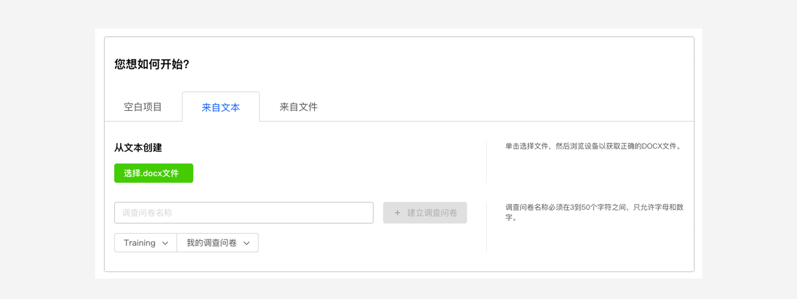

```index
3
```
```tag

```
```summary
按问卷文本格式编写Word问卷，上传问卷文本，直接创建简易问卷，无法再简便了。
```
# 从文本创建问卷

`巧思系统`支持从文本创建问卷。对于一些简单的、没有跳转逻辑的问卷，使用`Word`等文本编辑软件是最便捷的方式。使用文本编辑软件按格式编写内容，上传到系统后可以直接创建问卷。这份按格式要求编写的`docx`文件就称为`问卷文本`。



## 问卷文本格式说明
`问卷文本`要求按格式规范编写文档内容，格式要求：
+ 当文本问卷开头包含`问卷标题`和`问卷描述`时，代表这是一份完整的问卷。
+ 第一行有效文本会被作为问卷标题，其后的多行有效文本会被作为问卷描述，直到发现方括号`[]`包裹的题型名称。
+ 当发现方括号`[]`包裹的题型名称后，其后内容则为问卷的题目和选项。
+ 方括号`[]`必须为半角英文符号，中文`【】`不会别识别。
+ 添加题目时，用`[]`开头，并在`[]`内填入题型名称，后面接题目内容；回车后输入选项，每个选项占据一行。
    > 参考形式：
     ```
        [选择题]选择题样板
        选项1
        选项2
        选项3
     ```

+ 矩阵题的的所有列选项文字在同一行中，`英文空格`分割。
    > 参考形式：
     ```
        [矩阵题]矩阵题样板
        列1 列2 列3 列4
        行1
        行2
        行3
        行4
     ```

## 文本问卷案例
下面是一份完整的`docx`文本问卷内容：

```text
导入问卷样板问卷标题

导入问卷样板问卷描述第一行
导入问卷样板问卷描述第二行


描述节点]描述节点样板:这个模板开头设置了问卷标题和问卷描述,将会以完整导入的方式导入,即原问卷中的内容会被移除,导入部分成为新的问卷内容.

[选择题]选择题样板
选项1
选项2
选项3

[打分题]打分题样板
打分项1
打分项2
打分项3

[演示评价题]演示评价题样板
评价项1
评价项2
评价项3

[权重题]权重题样板
权重项1
权重项2
权重项3

[填空题]填空题样板
填空1
填空2
填空3

[排序题]排序题样板
排序项1
排序项2
排序项3

[菜单题]菜单题样板
菜单项1
菜单项2
菜单项3


[上传题]上传题样板
上传项1
上传项2
上传项3

[图片选择题]图片选择题样板
图片1
图片2
图片3


[图标题]图标题样板
图标1
图标2
图标3

[定位题]定位题样板

[范围定位题]范围定位题样板

[矩阵题]矩阵题样板
列1 列2 列3 列4
行1
行2
行3
行4

[结束]结束节点样板

```

> 以下题型可在文本问卷中使用：选择题、打分题、演示评价题、权重题、填空题、排序题、菜单题、上传题、图片选择题、图标题、定位题、范围定位题、矩阵题。
