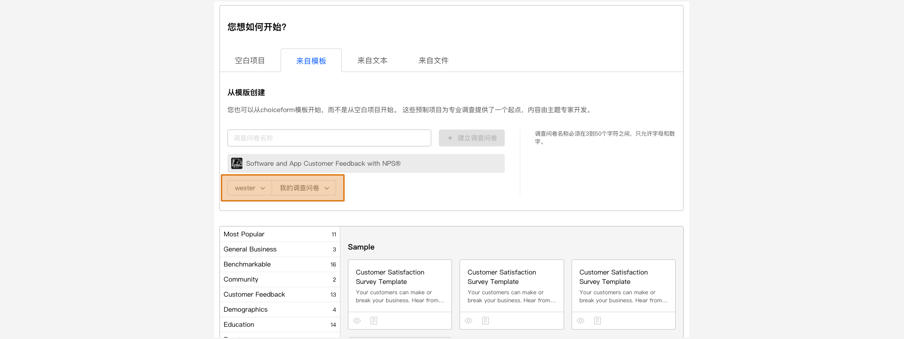

```index
1
```
```tag

```
```summary
问卷创建方式汇总。
```
# 创建问卷

点击`问卷管理`页面右上角的`建立调查问卷`创建一份新问卷。系统支持4种不同方式创建新问卷：

+ [创建空白问卷](./01fromBlankSurvey.md)
+ [从模板创建问卷](./02fromTemplate.md)
+ [从文本创建问卷](./03fromDocFile.md)
+ [从文件创建问卷](./04fromSurveyFile.md)



## 问卷项目名称
`问卷项目名称`与`问卷名称`不同，`问卷名称`会显示在问卷封面，被访者可以看到。而`问卷项目名称`显示在问卷卡片上，被访者无法看到。

## 问卷保存位置
选择合适的账号和目录，将在指定位置保存新问卷。
