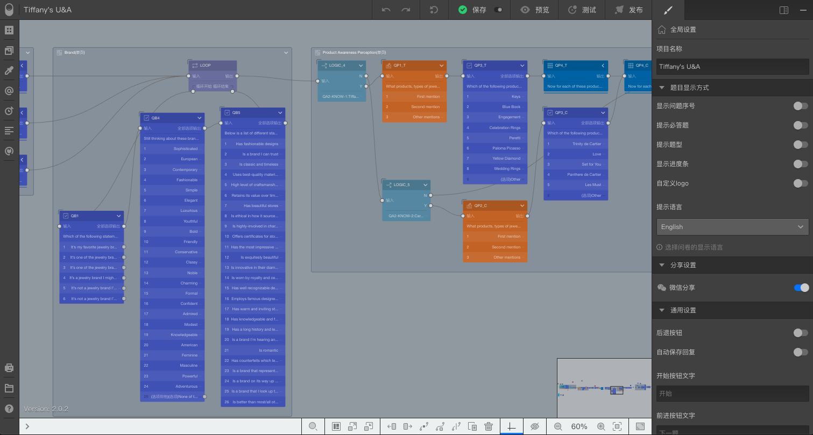

```index
1
```
```tag

```
```summary
问卷编辑器是最重要的问卷编辑工具，熟练使用问卷画布是熟练使用问卷编辑器的基础。
```
# 问卷编辑器画布区

`问卷编辑器画布区`是`问卷编辑器`的主区域，文档中提到的`画布区`、`画布`，都是指`问卷编辑器画布区`。



`画布`展示的是整个问卷流程，显示问卷的题目节点、跳转连线、题目组合等问卷核心部分，配合工具栏支撑起各种问卷编辑操作，问卷核心编辑操作均在画布完成。

问卷内容较多时`画布`中只能看到问卷的一部分，拖拽`画布`空白区域可以查看问卷的其他部分，也可以直接点击或拖拽`画布`右下角的`鹰眼缩略图`上的线框，快速跳到问卷的其他部分。鹰眼用于展示整份问卷的缩略图，鹰眼里面的小方框代表当前`画布`区域范围，从鹰眼可以看到整份问卷的内容和当前`画布`在整份问卷中所处的位置。

> 使用分辨率高的显示器，会让`画布`有更多的显示空间，设计问卷时更方便。

