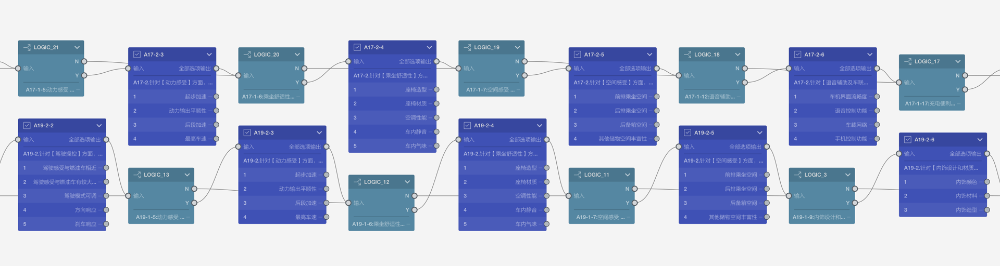
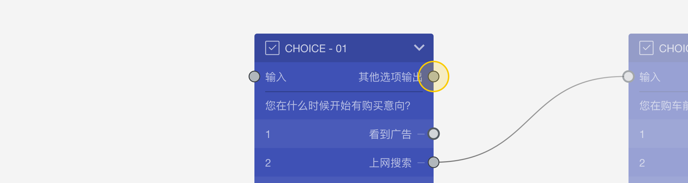

```index
2
```
```tag

```
```summary

```
# 节点
`节点`是问卷的最基本构成元素，节点在画布上表现为各种颜色的小方块，每种颜色代表一种题型或功能。



节点分为2种类型：
+ 题型节点：题型节点代表一种特定题目类型，一个题型节点就是一道问卷题目。
+ 工具节点。工具节点是问卷的一个特定功能，一个工具节点就是执行一个功能。

> 文档中的`题目`和`节点`一般代表相同的意思。
  
从`开始节点`到`结束节点`，问卷流程动线遇到一个节点时，要么显示一道题目，要么完成一个功能，通过观察画布上的节点和它们之间的连线，一目了然地看到问卷的基本架构。
> 一份问卷只能有一个开始节点，但可以有多个结束节点。
 
> 全部节点可参见[节点清单](../../10nodes/concept.md)中详细介绍

## 节点构成
大部分节点在画布中表现为一个方块。


上图是一个典型的节点方块，从上到下依次为：
+ 节点图标、节点名称、和节点收展按钮
+ 节点输入口和快捷输出口
+ 节点题目的内容文字 
+ 节点选项列表，每行代表一个选项。左边数字是选项编号，右侧文字是该选项的名称。有时，选项的最右侧显示了选项的输出口，可以为每个选项设定不同的输出。

## 输入口和输出口
节点上显示的小圆圈是节点的端口，端口分为输入口和输出口，它们各有不同的特性：


+ 输入口：
    + 只能作为连线的终点。
    + 一个节点的输入口可以作为多条连线的终点。
    + 一个节点只有一个输入口。
    + 显示在节点左上方。
+ 输出口：
    + 只能作为连线的起点。
    + 一个节点的输出口只能作为一条连线的起点，也就是说从输出口只能往外连一条线。
    + 一个节点可以有多个输出口。
    + 显示在节点右侧。

所有节点的输入口和输出口都必须有连线，除了下面的特殊情况：
+ 开始节点：只有输出，没有输入。
+ 结束节点：没有开启奖励的情况下，只有输入，没有输出。
+ 奖励节点：只有输入，没有输出。

## 快捷输出口
节点右上方有一个特殊的`快捷输出口`，快捷输出口有以下2种状态：



+ 全部选项输出：无论如何选择，都会从此输出口输出；
+ 其余选项输出：除了已经连线的选项输出口外，剩余的所有选项都会从此输出口输出；

快捷输出口主要用于提高工作效率，这样就不必为每个选项设置大量相同的输出了。

## 节点收起与展开
点击节点左上角的小箭头收起或展开节点，当选项较多且不想经常看到选项时，收起节点会更使画布更简洁。

<video id="video" controls="" preload="none">
    <source id="mp4" src="https://media.choiceform.com/doc-help/zh-cn/design/layout/canvas/collapse.mp4" type="video/mp4">
</video>

## 节点组合
多个节点可以进行组合，组合后节点组也可以收起和展开，收起后的节点组会收缩成一个小方块，组合内的节点都会藏起来。

<video id="video" controls="" preload="none">
    <source id="mp4" src="https://media.choiceform.com/doc-help/zh-cn/design/layout/canvas/group.mp4" type="video/mp4">
</video>

> 参照[组合与模块](../../17advancedFunction/02groupAndModule.md)了解更多组的信息。
