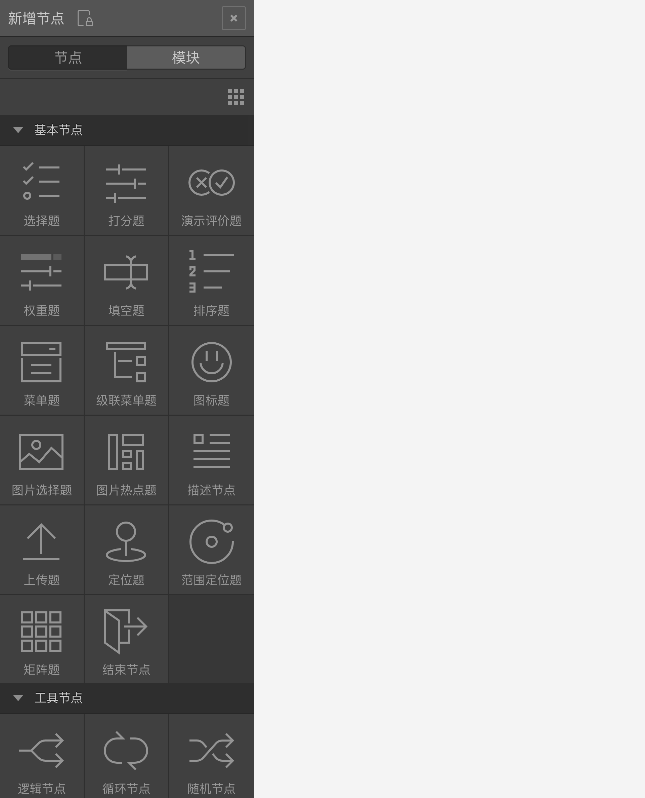
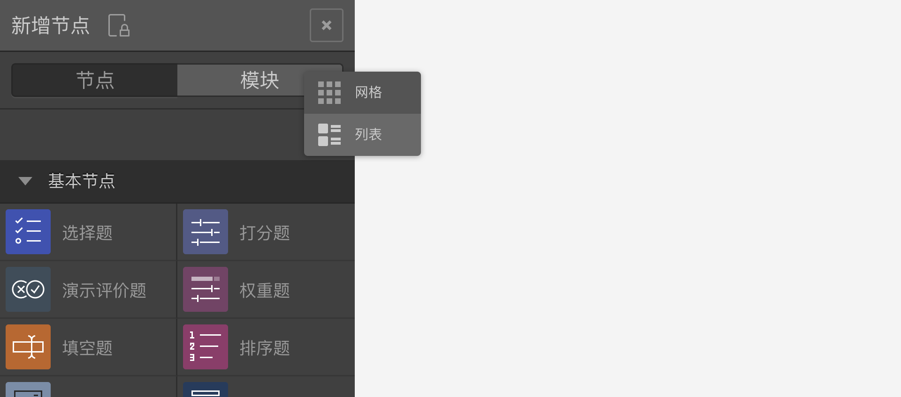

```index
1
```
```tag
节点库 模块库 新增节点 节点 模块 问卷编辑器 问卷组件工具栏 问卷编辑器操作界面
```
```summary
问卷节点库和模块库，30余款功能强大的问卷题目节点和功能节点，足以构建专业的调查问卷。
```
# 新增节点

`新增节点`面板里是系统的所有预置`节点`和`内容`模块。点击滑出新增节点库面板，其中包含`节点`和`模块`两个版块。



## 节点
`节点`里是系统的所有节点，包含`基本节点`和`工具节点`。点击节点图标，在画布区新增一个节点。或者拖动节点图标到画布的指定位置后释放鼠标，在指定的位置添加节点。

## 模块
`模块`里是用户保存的各类`问卷内容模块`。`问卷内容模块`是一组已编辑好的节点的集合，有时，因为某些题目组合会在很多问卷中用到，我们可以把这些题目节点存储为一个问卷内容模块。使用时，拖拽内容模块到画布区，就能在当前问卷中添加该内容模块。

选中模块后，下方`信息`面板会标明该模块创建者、创建时间、包含的节点数量、变量数量、图片或视频数量等等。点击信息面板上方的删除按钮，可以删除该模块。

> 在同一账号或组织里都能看到保存的问卷内容模块。

网格按钮用于切换排列方式。

