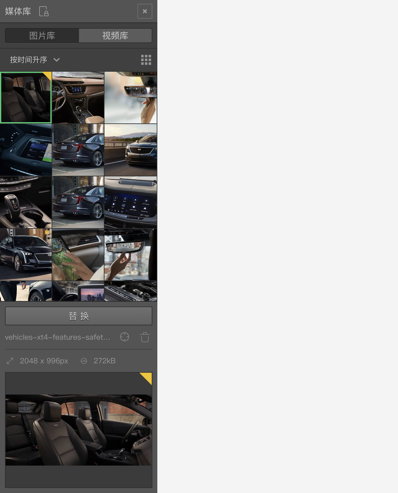

```index
2
```
```tag

```
```summary

```
# 媒体库

`媒体库`用来管理当前问卷中的媒体资源。点击滑出媒体库面板，其中包含`图片库`和`视频库`两个功能区。


## 图片库
问卷中的所有图片素材。


## 视频库
问卷中的所有视频素材。视频资源会默认使用视频的首帧作为缩略图。

  > 视频上传后，详细信息栏里可以预览观看视频。

## 上传媒体
点击下方的`上传`按钮上传媒体资源文件，上传完成后，媒体资源会显示在列表中。

## 查看媒体信息
选中媒体库里的媒体资源，下方滑出该媒体资源的详细信息面板。


媒体资源可以在`节点`和`变量`中引用。问卷中被引用的媒体资源右上角会有一个三角标记。如果三角形是半透明的，则说明该媒体资源虽然被引用了，但是使用它的节点或变量并没有被问卷实际使用。

鼠标移动到三角标记上，会显示引用了该媒体的节点清单，点击清单里的节点，画布会快速定位该节点，并居中显示。

### 删除媒体：
详细信息面板里，点击媒体资源名称右侧的删除图标，删除该媒体。

### 定位媒体：
详细信息面板里，点击媒体资源名称右侧的定位图标，在媒体资源列表中快速定位中该媒体。

### 替换媒体：
选中媒体库里的媒体资源，`上传`按钮变成`替换`按钮。点击`替换`按钮并重新选择一个媒体文件，将会上传并自动替换当前的媒体文件，替换媒体资源会自动更新问卷里所有使用该媒体资源的地方。

系统提供了3种媒体素材布局方式：

+ 网格
+ 列表
+ 小列表

还可以对媒体素材进行不同方式的排序：

+ 按时间升序
+ 按时间降序
+ 按字母升序
+ 按字母降序

> 关于媒体的使用方法参见[图片的使用](../media/image.md)和[视频的使用](../media/video.md)。关于媒体在变量中的使用请参见[媒体变量](../variable/media-type.md)。
