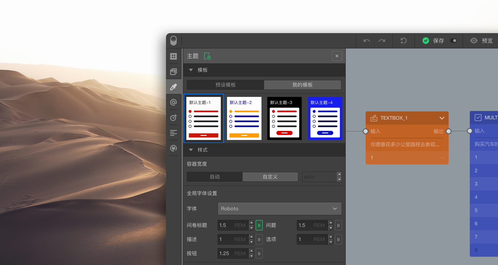

```index
3
```
```tag

```
```summary

```
# 主题

`主题`用于问卷颜色、字体大小等样式控制，点击后滑出`主题`面板。


## 样式
用于设定问卷标题、问题、选项等主要内容类型的颜色、字体等样式。

## 模版
系统预设了一些配色模板方案，用户也可以保存自己配色模板方案。


> 关于问卷样式的具体控制技巧，参见[主题与样式控制](../theme/concept.md)。