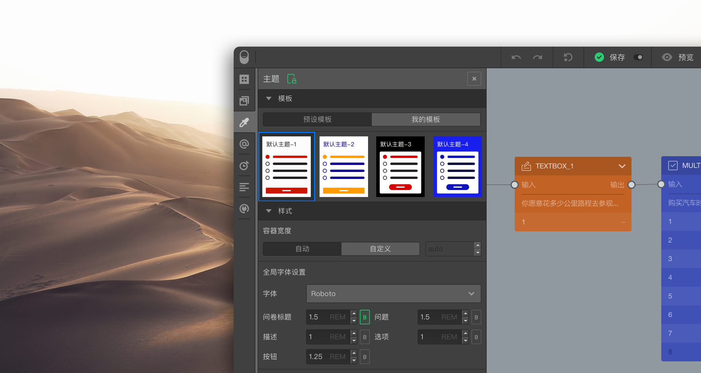
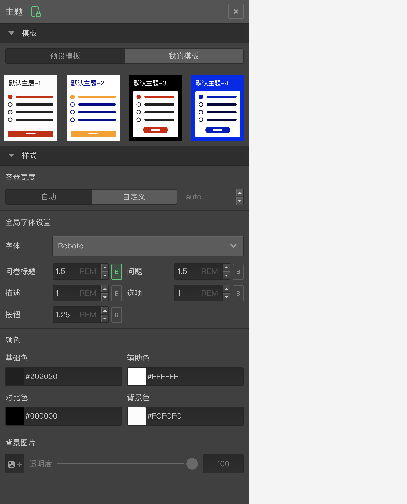
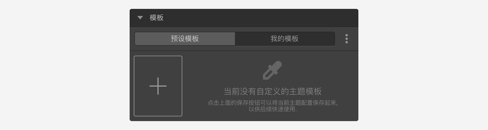

```index
3
```
```tag

```
```summary

```
# 主题

`主题`用于问卷颜色、字体大小等样式控制，点击后滑出`主题`面板。


## 模版
系统预设了一些模板配色方案，点选模板直接应用当当前问卷。


点击`我的模板`，用户也可以创建并保存自己配色模板方案。


## 样式
用于设定问卷标题、问题、选项等主要内容类型的颜色、字体等样式。

> 在题型节点的属性控制中，还可以[自定义字体尺寸](../../12layoutAndTheme/questionLayoutSetting/02userdefinedFontSize.md)。

