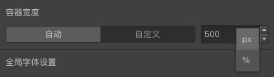

```index
3
```
```tag

```
```summary
如何提升问卷的视觉体验？如何使问卷更为独特？主题库里丰富的样式控制功能和预设主题，一定能为您的问卷添彩。
```
# 主题

`主题`用于问卷颜色、字体大小等样式控制，点击后滑出`主题`面板。


## 模版
系统预设了一些模板配色方案，点选模板直接应用当当前问卷。


点击`我的模板`，用户也可以创建并保存自己配色模板方案。


## 样式
用于设定问卷标题、问题、选项等主要内容类型的颜色、字体等样式。

+ 容器宽度
设置问卷页面容器的宽度，默认为`自动`，系统会自动适配终端类型。也可以选择`自定义`，个性化地设置容器宽度。


  
> 在题型节点的属性控制中，还可以[自定义字体尺寸](../../12layoutAndTheme/questionLayoutSetting/02userdefinedFontSize.md)。

