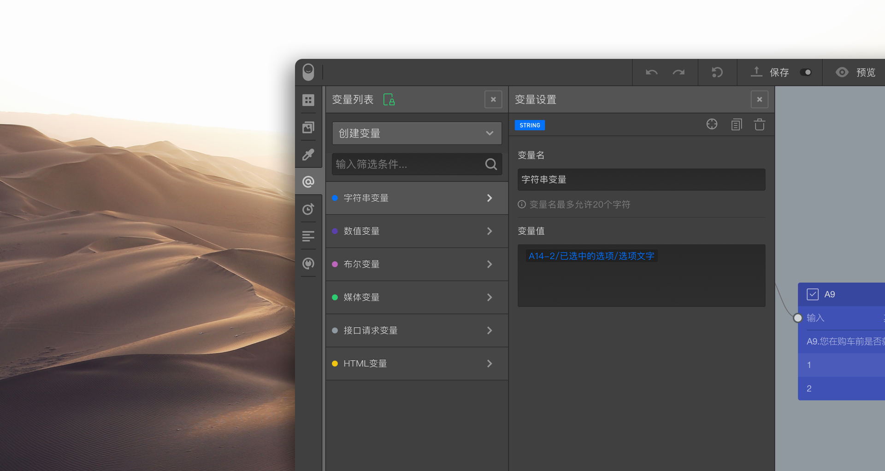

# 变量库

==变量库==用于创建和管理问卷的==显式变量==。

## 创建变量

点击==创建变量==，然后选择==变量类型==，在滑出的==变量设置==面板中添加==变量名==和==变量值==，设置完毕后就能添加一个变量。

## 查看变量信息

点击==变量列表==中的变量名称，右侧变量设置面板中就会展现该变量的内容。右上角的3个按钮分别为：定位变量、复制变量和删除变量。变量设置面板中，还显示使用了当前变量的对象，点击对象名称，将会定位到该对象。

变量可以在节点中使用，也可以作为其他变量的运算单元。被使用到的变量列表项的右上角会有一个三角形标记。如果三角标记是半透明的，则说明该变量虽然被引用了，但是引用它的节点或变量并没有被问卷实际使用。

> 变量是设计复杂问卷的利器，但要使用好它则必须掌握变量的详细规则和概念，详情参见[变量](../../16variable/01concept.md)里面的完整说明。