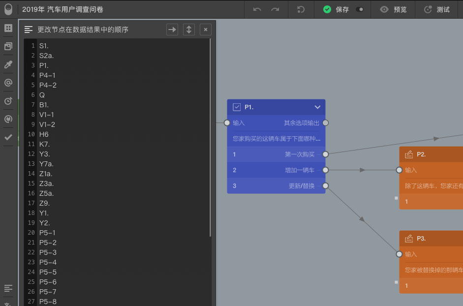

```index
6
```
```tag

```
```summary
查看问卷的所有题目节点，拖动改变题目在数据结果中的记录顺序。
```
# 节点导航

`节点导航`面板列出当前问卷的所有节点，包括已使用和未使用节点在内。点击后滑出`节点导航`面板。



## 改变问卷题目的输出顺序
问卷默认按深度优先策略遍历并输出，并且在节点导航面板中顺序展现。拖拽题目右边的图标改变题目的输出顺序，这个顺序也将会成为问卷数据结果展现时题目列的默认顺序。支持一键删除未使用节点。

> 可对题目节点打星标。