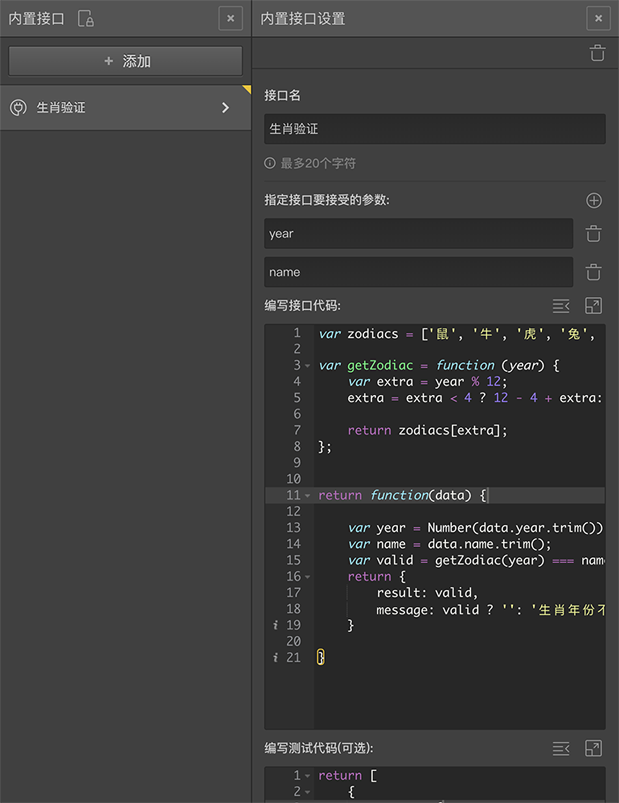
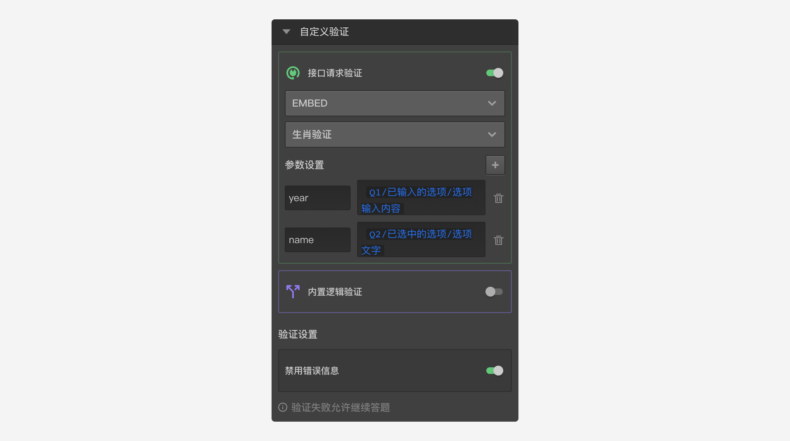

# 内置接口

==内置接口==用于编写和管理内置接口代码，点击后滑出内置接口面板。


==EMBED==方式也称为==内置接口==，允许在编辑器中直接编写==javascript==代码，达到和==FAKE==方式相同的效果，并且更简单。选择==EMBED==方式时，会显示一个下拉列表，在下拉列表中选择之前添加过的==内置接口==。

一般来说，代码量较少时可以使用==EMBED==方式。代码量很多的时候，使用==FAKE==方式维护起来更方便。当问卷上线后，==EMBED==方式必须先停止问卷才能修改，使用==FAKE==方式则没有这个限制。

> 如果检测到问卷在==EMBED==方式中使用了不安全的脚本，或问卷接到被访者投诉，客服会随时将其移出白名单而不实现通知。账号可能会被禁用。


点击左侧工具栏的==内置接口==按钮打开==内置接口面板==，点击==添加==按钮即可添加一个内置接口。



内置接口需要指定一个名称和一段==javascript==代码，可以添加参数和测试样例代码。

> 内置接口需要JS编程能力。

问卷的内置接口会显示在内置接口列表中，如果内置接口名称的右上角有一个黄色的小三角图标，说明该接口已经被题目节点所使用；如果小三角图标是半透明的，说明接口虽然被题目节点使用，但该题目节点没有被连接到问卷中。

点击任意项打开==内置接口设置==面板。


## 接口名

接口的名称，在==接口请求模块==中可以根据名字选择使用内置接口。

## 参数

指定接口的参数，指定参数名后，在接口请求模块中使用该内置接口时，必须为所有参数传入参数值。

接口代码可以从接口处理函数的第一个参数中用取属性的方式获得真实的参数，如上图中所的参数==p==和参数==q==，这个规则与接口请求中的==FAKE==请求方式的参数访问规则相同。

## 接口代码

按业务需求编写==javascript==代码。

接口代码最后必须返回一个函数作为接口处理函数，该函数的返回值必须是一个包含result和message属性的对象。

以上图中代码为例；这个名为==123==的接口要求两个参数==p==和==q==，在代码中，从处理函数的第一个参数==data==中取出真正的参数==p==和==q==，然后用==p==加上==p==与==q==的商作为计算因子，再乘以之前的一个随机数作为结果返回。

了解了编码规则后，再举一个有实用价值的例子：当给定的某个年份，和给定的某个生肖名称时，我们希望判断两者是否正确匹配。所以这个接口会要求两个参数：


+ ==year==参数：代表年份；
+ ==name==参数：代表生肖名称；

确定参数后，编写如下代码来进行判断。

```javascript
var zodiacs = ['鼠', '牛', '虎', '兔', '龙', '蛇', '马', '羊', '猴', '鸡', '狗', '猪'];

var getZodiac = function (year) {
    var extra = year % 12;
    extra = extra < 4 ? 12 - 4 + extra: extra - 4;

    return zodiacs[extra];
};


return function(data) {

    var year = Number(data.year.trim());
    var name = data.name.trim();
    // 因为农历和阳历年份存在交叉，我们向前容忍一级。
    var valid = getZodiac(year) === name || getZodiac(year - 1) === name;
    return {
        result: valid, 
        message: valid ? '': '生肖年份不匹配'
    }

}
```
通过上面的代码我们就能从给定年份和生肖名称中，判断两者是否匹配，如果不匹配的话还能给出自定义提示消息。

## 测试代码

为了确保编写的代码没有错误，或者在后续的更改中不会被改错，可以添加几个测试样例代码。

测试样例代码需要返回一个数组，数组的每一项是一个测试用例。如果不想提供测试代码，则需使用默认生成的测试代码，测试代码不能为空。

下面我们就给上面生肖验证的例子添加测试代码，并在代码注释中进行了说明。
```javascript
    return [
    {
        params: {
            year: '1989',
            name: '蛇'
        },
        result: true  // 1989年是蛇年，所以结果应该为true
    },
    {
        params: {
            year: '1989',
            name: '鼠'
        },
        result: false // 1989年不是鼠年，所以结果应该为false
    },
    {
        params: {
            year: '1991',
            name: '羊'
        },
        result: true // 1991年是羊年，所以结果应该为true
    }
    ];
```
如果提供了测试代码，系统将会自动运行测试。当用测试代码中指定的参数去调用接口代码得到的结果不是指定的结果时，就会报错。

## 使用内置接口

使用时，选择一个题目节点，然后打开==属性编辑工具栏==中的==设置==面板，设定==自定义验证==方式为==EMBED==，按要求设定参数和传入的选项变量。当被访者做到这道题目时，就会请求内置接口。

