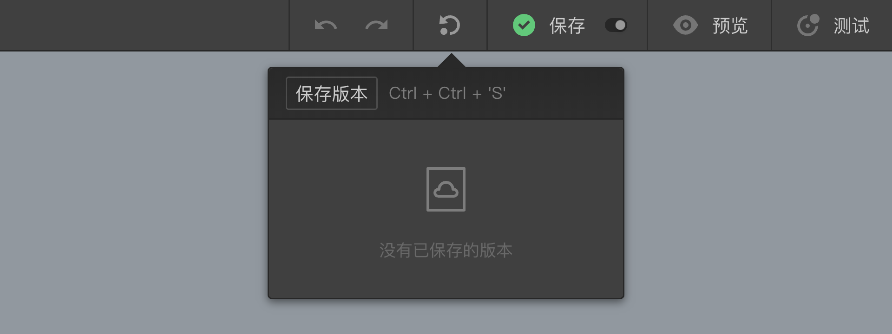

```index
2
```
```tag

```
```summary
问卷编辑好了又要改，改完后如果客户觉得还是以前的版本好，岂不是又要改回来？别慌，保存问卷版本，随时回退到重要的里程碑。
```
# 问卷保存和问卷版本

## 问卷保存
保存问卷。问卷会保存在云端.

> 将问卷保存到本地存储需使用`导出`功能。

## 自动保存
开启/或关闭`自动保存`功能，开启后每隔3分钟会自动保存问卷。

## 问卷版本
工作中，经常会遇到问卷经过几次大的修改后，不得不改回最初设计的情况，造成大量重复工作。其实，当问卷设计到一个阶段时，可以把当前问卷保存为一个`问卷版本`作为备份。后续需要时，可以随时恢复之前保存的问卷版本，并在此基础上重新开始编辑。



## 保存问卷版本
点击顶部`问卷发布`工具栏上的`保存版本`按钮，可以将问卷的当前状态保存为一个版本，保存完毕后`保存`按钮下方会出现版本列表。


> 同一份问卷可以保存为多个不同的问卷版本。

## 恢复问卷版本
点击列表中的`问卷版本`名称，恢复该问卷版本并覆盖当前问卷设计。


## 编辑问卷版本名称
点击`编辑`按钮，修改问卷版本名称。

## 删除问卷版本
点击`删除`按钮删除该问卷版本。
