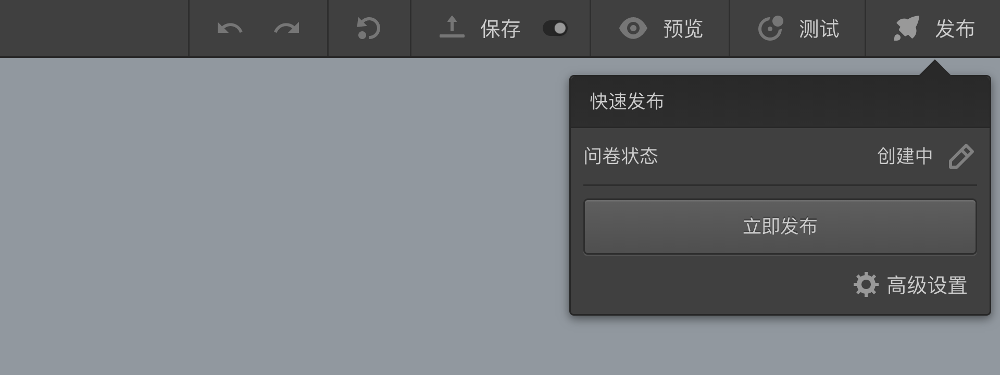
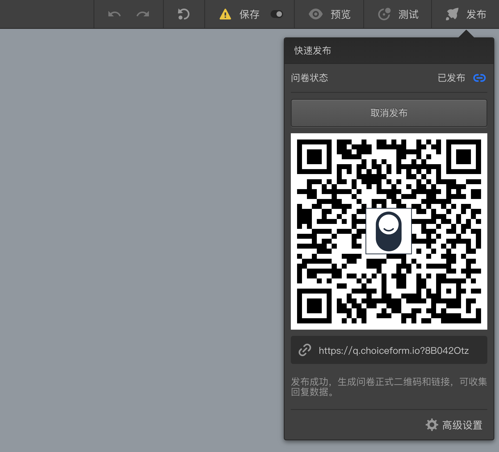
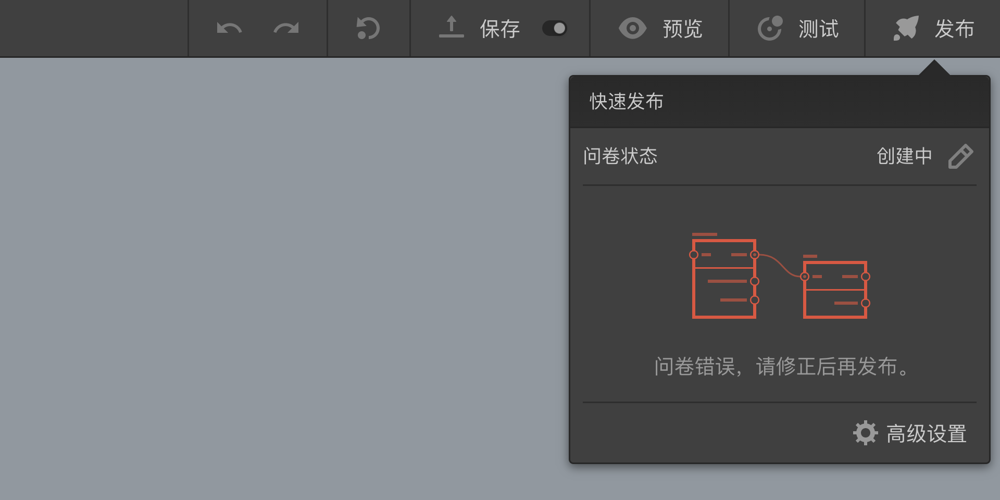
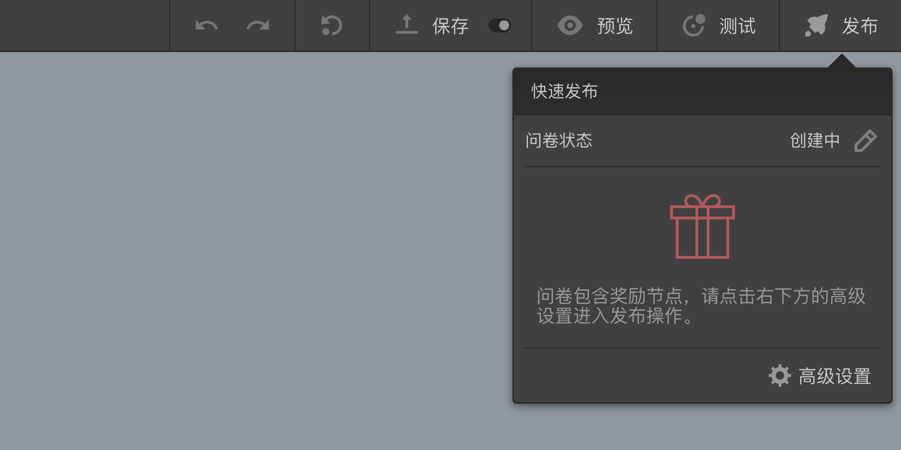

```index
4
```

```tag

```

```summary

```
# 快速发布
当问卷通过[问卷测试](../../06preview/03debugAndTest.md)后，就可以发布问卷开始收集数据。

将鼠标放到顶部`问卷发布`工具栏右侧的`发布`按钮，浮出`快速发布`面板，点击`立即发布`按钮就会将问卷变成发布状态。


随后，发布框中会出现问卷正式页面的二维码和链接，目标被访者扫码或者点击链接，就可以收集问卷数据了。


> 快速发布的问卷默认为立刻上线，收集数量默认为无限。

如果无法发布问卷，意味着问卷包含错误，或者问卷包含红包奖励。
+ 问卷错误：问卷包含错误时，面板显示问卷错误提示信息。


这时，应先尝试[错误修改和测试](./debug.md)来修复错误。

+ 包含红包奖励：带有红包等奖励的问卷必须先设定收集数量，并计算相关资金。这时，需要按提示点击`高级设置`按钮，前往`高级设置`页面完成发布操作，



  包含红包奖励的问卷设置参见[问卷红包奖励](./reward.md)。

发布状态的问卷会被系统锁定，问卷编辑器可以查看问卷内容，但无法被编辑和保存。

## 快速取消发布
发布状态下，在问卷编辑器点击快速发布框中的`取消发布`按钮，可以取消发布，问卷下线停止数据收集，问卷回到可编辑状态。


