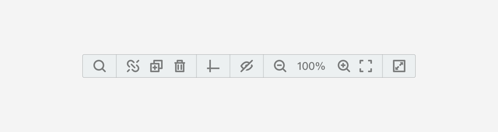
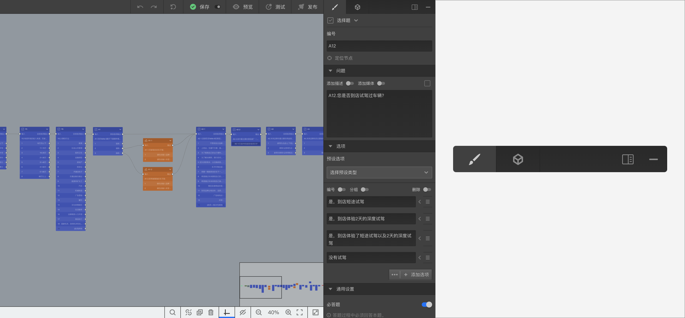
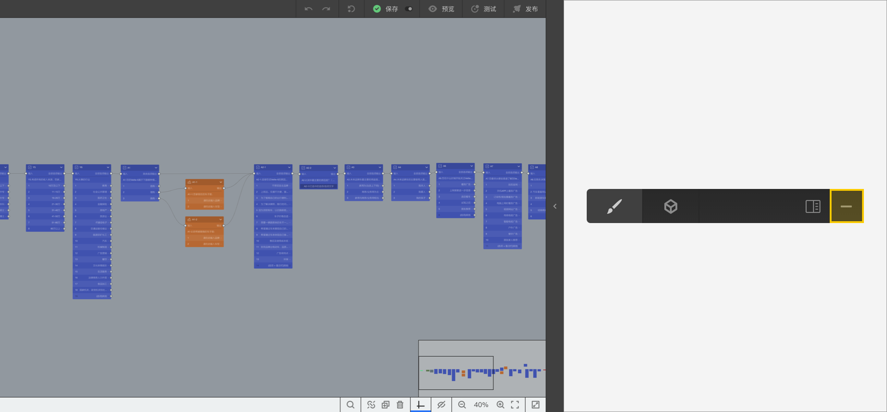
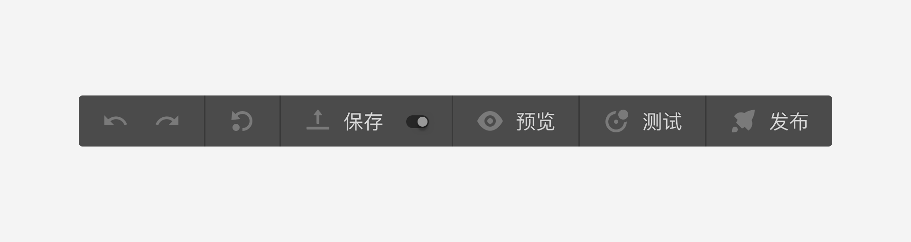
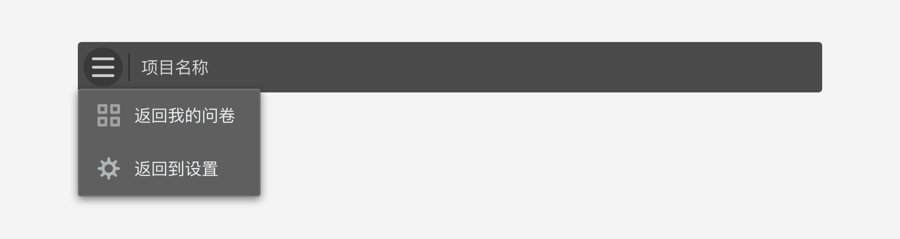

# 问卷编辑器操作界面

## 画布区

==画布区==是==问卷编辑器==的核心操作区域，问卷题目节点摆放在==画布区==，通过连线操作和属性设置，逐步完成问卷的所有编辑工作。

## 问卷组件工具栏

==问卷组件工具栏==集成了==问卷编辑器==的包括节点库、媒体库、变量库等核心组件和工具。

## 视图操作工具栏

==视图工具栏==的集成了==画布区==视图操作工具，可以对对画布进行放大、缩小等视图操作，帮助您掌控问卷内容，提高工作效率。

## 属性编辑工具栏

==属性编辑工具栏==是问卷属性和题目节点属性设置最重要的工作面板，在问卷编辑过程中，用于设定各项属性。

为便于问卷编辑和设定，可以展开==属性编辑工具栏==以便于属性设定。

或者收起隐藏==属性编辑工具栏==，以显示更多的==画布区==空间。

## 问卷发布工具栏

==问卷发布工具栏==集成了问卷测试、预览和发布功能，以及问卷保存等功能。

## 离开问卷编辑器

点击==问卷编辑器==左上角Logo标志，弹出返回菜单，可选择==返回我的问卷==或者==返回到设置==。

