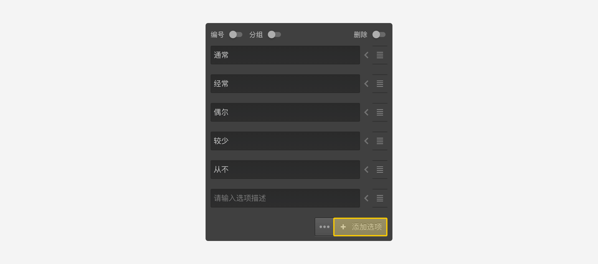
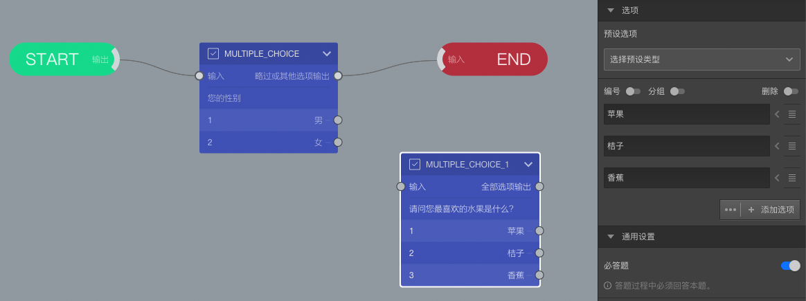

```index
2
```
```tag
增加题目选项 试一试 设定选项内容 增加选项 案例
```
```summary
添加题目选项。
```
# 增加题目选项

在画布上选择一道题目，然后打开左侧`属性编辑工具栏`。创建题目节点时，默认情况下，系统会为每个题目创建默认选项。

点击`属性编辑工具栏`的题目选项下方的`添加选项`按钮，增加题目选项。



## 试一试

### 设定选项内容
创建`MULTIPLE_CHOICE_1`节点时，自动生成了2个空白选项。现在选中`MULTIPLE_CHOICE_1`节点，在右侧`属性编辑栏`中设定选项内容为：苹果、桔子。

### 增加选项
随后点击`添加选项`为这道题目增加一个选项，并设定选项内容为：香蕉。


