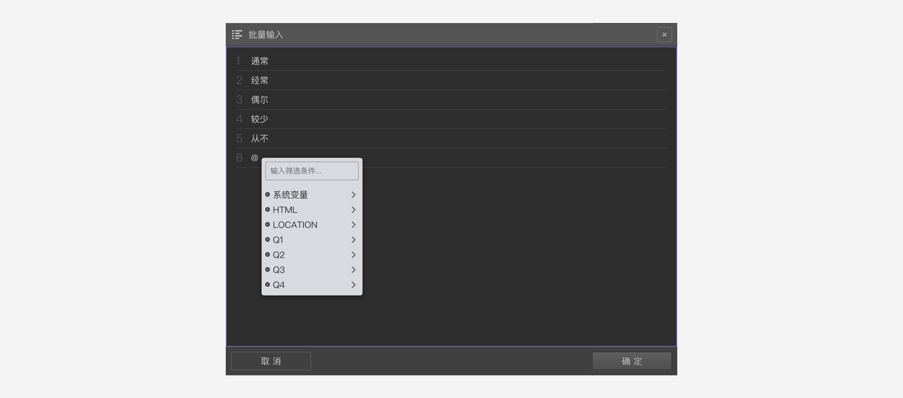

```index
3
```
```tag

```
```summary
选项太多了，一项一项输入选项太慢了，批量输入选项更方便些。
```
# 批量输入选项

当选项较多时，可以用下面2种方法打开`批量输入`窗口，批量增加题目的选项：

+ 双击画布上的节点弹出`批量输入`对话框，批量输入选项内容。
+ 点击`添加选项`左边的`高级设置`按钮，在弹出菜单种选择`批量输入`，批量输入选项内容。


窗口中的每一行就是一个选项。输入完成后点击`确定`，就会按行分自动生成题目选项。

批量输入时支持输入变量内容。


## 试一试

### 批量增加选项
双击画布上的`MULTIPLE_CHOICE_1`节点，打开`批量输入`窗口，窗口的选项列表里可以看到当前的苹果、桔子、香蕉选项，并且光标停留在最后的位置。

按下键盘`ENTER`键，新增一行，输入菠萝。按下键盘`ENTER`键，新增一行，输入草莓，随后点击确定关闭窗口。画布上的`MULTIPLE_CHOICE_1`节点的选项已经更新了。


